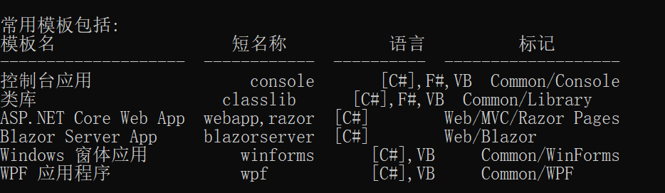
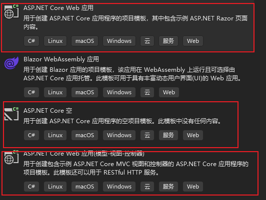
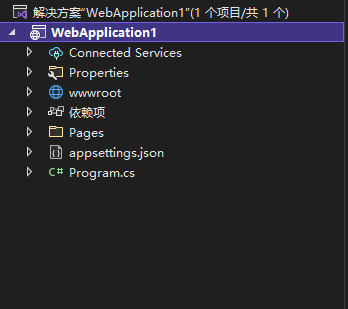

# C# 10 & .Net 6 

## 一 . C#简介

C# 从2002年微软推出开始,这个语言就是微软主推的编程语言,微软为了让他满足windows使用,没有考虑到跨平台的功能,所以使用人数较少.到2010年,有个公司为了开发Android App和IOS App,自己用C#研发出一个跨平台的技术,这个技术叫做Mono,Untiy3D制作的游戏,里面也是使用了大量的C#代码,做的跨平台游戏.,到了2015年,微软公司发现自己的技术一直处于弱势,所以微软公司开始了重新部署全生态的架设,微软公司做的第一步: 开源C#代码,把C#7.0之后的C#源码发送到github上进行开源,允许所有人观看,第二步: 收购github , 第三步: 开发完全新的支持跨平台的C#语言,并且舍弃掉原先臃肿的.net framework框架,发布新的.net core技术.从2015年开始到2020年11月份为止,.net framework框架与.net core框架并行,同时存在并且互不兼容. 2020年微软公司发布了.net 5它把.net framework和.net core进行了合并,只要我们之前学习过.net framework 4.7.2或者.net core 3.1的都可以顺滑的过渡到.net 5时代,.net 5 语法,项目结构都是以.net core为基础的..net 5是微软公司做的一个短期支持版本,今年2021年10月8号发布了.net 6 在.net 5基础上进行了优化,并且发布了新的C#10语法.

## 二. C#能做什么


## 三. C# Cli技术

cli指的是脚手架技术,这个技术主要针对于的是我们在不同的平台上都能进行C#代码开发,使用的工具 visual studio code

我们想要用cli技术创建项目需要确保,我们自己的电脑当中安装有.net core对应的sdk

.net 6 的sdk我们需要去官网进行下载网址:[https://dotnet.microsoft.com/en-us/download](https://dotnet.microsoft.com/en-us/download)

> 注意: 当我们电脑安装有vs2022或者最新版的vs2019,不需要安装上面的sdk,vs安装的时候已经安装完了


### 1. dotnet 指令

dotnet指令是我们在不同系统电脑里都可以创建c#项目的命令,这个命令相当于我们之前记的Linux当中的指令

#### a. dotnet new

``` shell
dotnet new 对应项目简写名称
```

项目对应的简写名字




例如: 我们现在要去创建一个控制台项目,输入的命令是

``` shell
dotnet new console
```

#### b. dotnet restore

这个命令是让我们重构当前的项目,把当前的项目创建时,没有带有的依赖性引入,我们如果用vs code进行开发,基本不用

#### c. dotnet run

这个命令是让我们运行代码的,让我们项目代码直接在cmd当中运行


> .net core项目与.net framework项目有啥区别:
>
> 1. .net core当中去除了config文件,所有的配置信息不会再由这种xml文件进行书写了,在.net core当中它叫做appsettings.json
> 2. .net framework下webform项目和一般处理程序创建的应用内容都没有主方法,但是.net core当中有
> 3. .net core项目当中不存在引用了,而是用依赖项代替了,.net framework项目会把所有要用到的引用基础在框架当中,导致我们创建项目时,不管用不用的上的内容都在项目里,.net core不是,它里面只包含了基础内容,如果不是基础内容我们需要额外引入
> 4. .net framework web项目只能在iis环境下运行,但是.net core不是,可以采用反向代理,通过控制台运行


### 2. vs2022创建web项目



上面的三个内容都是web项目的模板, 

ASP.NET Core 空,这个项目所有的配置都不存在,只存在基本的简单设置,能确保这个项目运行起来,这个项目也是最干净的,我们一般不用这个

Asp.Net Core Web应用, 这个里面带有微软公司创建的一个简单模板,里面的技术采用的时razor技术,这种技术适用于简单,或者较小的项目,这种技术的特点于webform比较类似,但是不存在拖拽的控件

Asp.Ner Core Web应用(模型-视图-控制器) ,这个是mvc架构项目,里面带有微软公司创建简单案例,这种技术适用于复杂的或者中大型项目

**上面的三种模型可以互相切换,主要就是根据我们配置信息的更改进行切换**

Asp.Net Core Web应用项目架构如下:



| .net framework | .net core                                                 |
| -------------- | --------------------------------------------------------- |
| 引用           | 依赖项                                                    |
| web.config     | appsettings.json                                          |
|                | wwwroot , 这个是让我们用于存储静态资源,如图片,样式,脚本等 |
|                | Program.cs , 这个是对当前项目正确配置或者说项目的设定     |

**C#从2007年之后,创建出新的MVC架构之后所有的界面扩展名全换了,原来webform的扩展名是aspx,mvc改为cshtml,让里面的内容完全遵守html代码,并且其中可以插入c#代码**

