# 1. C# 10 & .Net 6 

## 一 . C#简介

C#(CSharp)是一种新式编程语言,不仅面向对象,还类型安全.开发人员利用C#能够生成在.NET中运行的多种安全可靠的应用程序.C#源于C语言系列,C,C++,Java和JavaScript程序员很快就可以上手使用.

C#是面向对象的,面向组件的编程语言.C#提供了语言构造来直接支持这些概念,让C#成为一种非常自然的语言,可用于创建和使用软件组件.**C#语言的最新版本是C#10**

## 二. .Net 简介

.Net是一种用于构建多种应用的免费开源开发平台,我们可以通过.Net平台进行下图中内容的开发


* 桌面应用
  * Windows WPF
  * Windows 窗体
  * 通用的Windows平台(UWP)
*  Web应用,Web Api和微服务
* 云中的无服务器函数,云原生应用
* 移动应用
* 游戏
* 物联网(IoT)
* 机器学习

我们可以使用类库在不同应用和应用类型中共享功能.

**跨平台**

我们现在可以为许多操作系统创建.Net应用,包括:

* Windows
* Linux
* macOS
* Android
* iOS
* tvOS
* watchOS

支持的处理器体系结构包括:

* X64
* X86
* ARM32
* ARM64

**SDK和运行时**

.Net SDK是一组用于开发和运行.Net应用程序的库和工具.

下载.NET的时候,我们可以选择SDK或者运行时,例如.Net运行时或ASP.NET Core运行时.在要准备运行.Net应用的计算机上安装运行时.在要用于开发的计算机上安装SDK.(**一般我们服务器上安装的是运行时,自己的开发电脑会安装SDK**)

> 如果自己的电脑已安装vs2019或者vs2022,则该ide工具自带安装了,不需要我们再去手动安装SDK

SDK下载地址: [https://dotnet.microsoft.com/en-us/download](https://dotnet.microsoft.com/en-us/download)

SDK下载包括以下组件:

* .Net Cli . 用于本地开发和持续集成脚本的命令行工具
* `dotnet` 驱动程序. 用于运行依赖于框架的应用的CLI命令
* Roslyn和F#编程语言编译器
* MSBuild生成引擎
* .NET运行时. 提供类型系统,程序集加载,垃圾回收器,本机互操作和其他基本服务
* 运行时库. 提供基元数据类型和基本实用程序
* ASP.NET Core运行时. 为连接Internet的应用(如Web应用,IoT应用和移动后端)提供基本服务
* 桌面运行时.为Windows桌面应用(包括Windows窗体和WPF)提供基本服务

运行时下载包括以下组件:

* (可选) 桌面或ASP.NET Core 运行时
* .Net 运行时. 提供类型系统,程序集加载,垃圾回收器,本机互操作和其他基本服务
* 运行时库. 提供基元数据类型和基本实用程序
* `dotnet` 驱动程序. 用于运行依赖于框架的应用的CLI命令

## 三. .NET CLI技术

.NET 命令行接口(CLI)工具是用于开发,生成,运行和发布.NET应用程序的跨平台工具链

> 主要针对于的是在macOS环境下或者Linux环境下做.net开发的人员,windows环境下使用的vs开发工具底层也是通过这些指令进行操作的

### 1.  CLI命令

CLI命令共包含四种命令: 基本命令,项目修改命令,高级命令,工具管理命令

#### a. 基本命令

| 命令    | 说明                                                         |
| ------- | ------------------------------------------------------------ |
| new     | 创建命令,用于创建项目                                        |
| restore | 恢复项目的依赖项和工具                                       |
| build   | 生成项目及其所有依赖项                                       |
| publish | 将应用程序及其依赖项发布到文件夹以部署到托管系统             |
| run     | 无需任何显示编译或启动命令即可运行源代码                     |
| test    | 用于执行单元测试的.NET测试驱动程序.                          |
| vstest  | 从指定的程序集运行测试                                       |
| pack    | 将代码打包到 NuGet 包                                        |
| migrate | 将预览版 2 .NET Core 项目迁移到 .NET Core SDK 样式的项目中   |
| clean   | 清除项目输出。                                               |
| sln     | 在 .NET 解决方案文件中列出或修改项目                         |
| help    | 命令打开 docs.microsoft.com 参考页，以提供指定命令的更多详细信息。 |
| store   | 将指定的程序集存储到[运行时包存储区](https://docs.microsoft.com/zh-cn/dotnet/core/deploying/runtime-store)。 |

#### b. 项目修改命令

| 命令             | 说明                        |
| ---------------- | --------------------------- |
| add package      | 向项目文件添加包引用        |
| add reference    | 添加项目到项目 (P2P) 引用。 |
| remove package   | 从项目文件删除包引用。      |
| remove reference | 删除项目到项目 (P2P) 引用。 |
| list reference   | 列出项目到项目引用          |

#### c. 高级命令

| 命令                  | 说明                                                         |
| --------------------- | ------------------------------------------------------------ |
| nuget delete          | 从服务器删除或取消列出包。                                   |
| nuget locals          | 清除或列出本地 NuGet 资源。                                  |
| nuget push            | 将包推送到服务器，并将其发布                                 |
| msbuild               | 生成项目及其所有依赖项。 注意：如果有多个解决方案或项目文件，可能需要指定一个。 |
| dotnet install script | 用于安装 .NET SDK 和共享运行时的脚本。                       |

#### d. 工具管理命令

| 命令           | 说明                                                         |
| -------------- | ------------------------------------------------------------ |
| tool install   | 在计算机上安装指定的 [.NET 工具](https://docs.microsoft.com/zh-cn/dotnet/core/tools/global-tools) |
| tool list      | 列出计算机上当前安装的所有指定类型的 [.NET 工具](https://docs.microsoft.com/zh-cn/dotnet/core/tools/global-tools) |
| tool update    | 在计算机上更新指定的 [.NET 工具](https://docs.microsoft.com/zh-cn/dotnet/core/tools/global-tools)。 |
| tool restore   | 通常将本地工具添加到存储库的根目录。 将清单文件签入到存储库后，从存储库中签出代码的开发人员会获得最新的清单文件。我们可以通过这个命令安装清单文件中列出的所有工具 |
| tool run       | 用于调试本地工具                                             |
| tool uninstall | 从计算机上卸载指定的 [.NET 工具](https://docs.microsoft.com/zh-cn/dotnet/core/tools/global-tools)。 |

**命令结构**

CLI命令结构包含驱动程序(dotnet)和命令,还可能包含命令参数和选项.在大部分CLI操作中可看到此模式,例如:创建新控制台应用并从命令行运行该应用

``` shell
dotnet new console #console是控制台的短命称
```

## 四. C# 基础语法

### 1. C#语言发展

微软公司于2002年发布的C#1.0语法，到现在已经有20年了，今年正好是.net20周年。微软公司基本每隔几年就会发布一个新的版本C#，每次发布的内容更改具体内容如下

C# 1.0 其中包含了静态类型的面向对象编程语言的所有重要特性

C# 2.0 是在2005年发布的，重点内容是使用泛型实现强数据类型，提高代码的性能，减少类型错误

C# 3.0 是在2007年发布的，重点内容是使用语言集成查询（Linq）以及匿名类型和Lambda表达式的支持，并且在这一年微软发布了一种新的开发模式 --- MVC模式

C# 4.0 是在2010年发布的，重点内容是利用F#和Python等动态语言改进互操作性，其中包括 动态类型，命名可选参数

C# 5.0 是在2012年发布的，这个也是我们学校主要学习的内容，重点知识是简化异步操作支持，从而在编写类似于同步语句的语句时自动实现复杂的状态机

C# 6.0 是在2015年发布的，并且这一年也是.net core出现的一年，这一年C#语法没有发生太大的改变，只是在原有的基础上新增了静态导入，内插字符串，表达式体成员等

C# 7.0 是在2017年发布的，重点是添加功能语言特性，如：元组和模式匹配，还对语言做了细微的改变，具体如下：

| 功能                     | 主题                       |
| ------------------------ | -------------------------- |
| 二进制字面量和数字分隔符 | 存储整数                   |
| 模式匹配                 | 利用if语句进行模式匹配     |
| out变量                  | 控制参数的传递方式         |
| 元组                     | 将多个值与元组组合在一起   |
| 局部函数                 | 定义局部函数               |
| 默认字面量表达式         | 使用默认字面量设置字段     |
| 推断元组元素的名称       | 推断元组的名称             |
| async Main               | 改进对控制台应用程序的响应 |
| 数字字面量中的前导下画线 | 存储整数                   |
| 非追踪的命名参数         | 可选参数和命名参数         |

C# 8.0 是2019年发布的，主要关注与空处理相关的语言的重大变化，主要内容如下：

| 功能           | 主题                           |
| -------------- | ------------------------------ |
| 可空引用类型   | 使引用类型可空                 |
| switch表达式   | 使用switch表达式简化switch语句 |
| 默认的接口方法 | 了解默认接口方法               |

C# 9.0 是2020年发布，关注于记录类型，模式匹配的细化以及极简代码（Minimal-Code）控制台应用程序，主要内容如下：

| 功能                   | 主题             |
| ---------------------- | ---------------- |
| 极简代码控制台应用程序 | 顶级程序         |
| 改进的模式匹配         | 与对象的模式匹配 |
| 记录                   | 操作记录         |

### 2. 使用变量

#### 2.1 命名

|  命名约定  |       示例        |                  使用场合                  |
| :--------: | :---------------: | :----------------------------------------: |
|  驼峰命名  | cost,orderDetails |             局部变量，私有字段             |
| pascal命名 | Cost,OrderDetails | 类型，非私有字段，以及其他成员（如：方法） |

#### 2.2 常用的数据类型

C#当中常用的数据类型一共有2种，分别是 值类型和引用类型，他们分别包含了多种的内容，具体如下：

| 类型名   | 包含内容                                        |
| -------- | ----------------------------------------------- |
| 值类型   | int, double,float ,demial,bool,char,enum,struct |
| 引用类型 | string, class , object , array                  |

> 面试题： 
>
> 1. double 与 decimal 的区别：
>
>    double类型并不能保证值是精确的，因为有些数字不能表示为浮点型，decimal类型是精确的，因为这种数据类型可以将数字存储为大整数并移动小数点。
>
>    除此之外我们还需要注意double数据类型的值不能使用==来进行判断相等，历史上第一次海湾战争期间，美国爱国者导弹系统在计算的时候就是使用了double值，这种不精确性导致导弹无法跟踪和拦截来袭的伊拉克飞毛腿导弹。

**微软公司强烈推荐创建变量的时候使用var弱类型进行创建**

#### 2.3 控制流程和转换类型

##### 2.3.1 运算符

首先我们现需要去了解一下运算符，之前我们学习的时候也是学习了运算符的，运算符可将简单的操作应用于操作数，他们通常会返回一个新值，作为分配给变量的操作结果。

大多数的运算符都是二元的，这意味着他们可以处理两个操作数，例如：

``` C#
var resultOfOperation = firstOperand operator secondOperand
```

> 注： operator这个是c#当中的关键字是操作符的意思

###### 2.3.1.1 一元运算符

我们日常开发当中有2个常用的一元运算符，++ 和 --,我们常用这两个运算符进行值的递增和递减，我们需要注意这两个符号操作时值的变化，这个是重点

###### 2.3.1.2 二元运算符

二元运算符其实就是我们在学校学习的这些运算符了，包括： 算数运算符，赋值运算符，逻辑运算符，关系运算符，除此之外我们还有其他运算符，例如：

nameof 与 sizeof 这两个也是我们比较常用的运算符，他们属于其他运算符。

nameof 它会以字符串格式的形式返回变量、类型或成员的短名称（没有命名空间），这在输出异常消息的时候非常有用

sizeof 它会返回简单类型的字节大小，这对于数据存储的效率很有用。

##### 2.3.2 选择语句

 选择语句当中我们比较常用的是if语句和switch语句，if语句可以适用于所有的选择情况，但是在一些常见的场景种使用switch语句会简化代码，例如：当一个变量有多个值，而每个值都需要进行不同的处理时

###### 2.3.2.1 if语句

if语句的几种模式就不介绍了，在这里我们主要还是需要讲解一下C# 7.0新增的模式匹配

在C# 7.0之后的语法当中，if语句可以将is 关键字与局部变量声明结合起来进行使用，从而使代码更加安全。例如下面的代码：

``` C#
object o = 3;
int j = 4;
if(o is int i)
{
    Console.WriteLine($"{i} x {j} = {i*j}");
}
else
{
    Console.WriteLine("o is not an int , so it cannot multiply!");
}
```

运行上面的代码，控制台会输出

3 x 4 = 12

###### 2.3.2.2 switch语句

与上面的if语句一样，在C# 7.0之后模式匹配也可以与switch语句连用。case后面的值不再必须是字面值，还可以是模式。

下面看一个使用文件夹路径与switch语句匹配的模式示例。

``` C#
using System;
using System.IO;

static void Main(string[] args)
{
	string path = @"c:\Code\Demo1";
    Console.Write("Press r for readonly or w for write");
    ConsoleKeyInfo key = Console.ReadKey();
    
    Stream s = null;
 	if(key.Key == ConsoleKey.R)
    {
        s = File.Open(
        	Path.Combine(path,"file.text"),
            FileMode.OpenOrCreate,
            FileAccess.Read);
    }
    else
    {
        s = File.Open(
        	Path.Combine(path,"file.text"),
            FileMode.OpenOrCreate,
            FileAccess.Write); 
    }
    string message = string.Empty;
    switch(s)
    {
        case FileStream writeableFile when s.canWrite:
            message = "the stream is a file that I can write to.";
            break;
        case FileStream readOnlyFile:
            message = "the stream is a read-only file.";
            break;
        case MemoryStream ms:
            message = "the stream is a memory address.";
            break;
        default:
            message = "the stream is some other type.";
            break;
        case null:
            message = "the stream is null.";
            break;
    }
    Console.Write(message);
}
```

运行控制台程序，我们会发现，名为s的变量被声明为Stream类型，因而可以是流的任何子类型，比如内存流或文件流。在上面这段代码种，流是使用File.Open方法创建的文件流。由于使用了FileMode,而文件流是可写的或只读的，因此我们会得到一条描述情况的消息，如下：

> the stream is a file that I can write to.

看了上面的代码我们发现在case语句后面是可以包含when关键字以执行更具体的模式匹配的，观察上面的代码。在第一个子句case中，只有当流是FileStream且CanWrite属性为true时，s变量才是匹配的。

在C#8.0及更高的版本中，可以使用switch表达式简化switch语句。

大多数的switch语句都非常简单，但是他们需要大量的输入。switch表达式的设计目的是简化需要输入的代码，同时仍然表达相同的意图。所有的case子句都将返回一个值以设置单个变量。switch表达式使用 => 来表示返回值。

下面我们通过这种简化写法把上面代码中的switch语句简化一下：

``` C#
message = s switch
{
    FileStream writeableFile where s.CanWrite
        => "the stream is a file that I can write to.",
    FileStream readOnlyFile
        => "the stream is a read-only file.",
    MemoryStream ms 
        => "the stream is a memory address.",
    null
        => "the stream is null.",
    _
        => "the stream is some other type."    
};
Console.Write(message);
```

区别主要是去掉了case和break关键字，下划线字符用于表示默认的返回值。

##### 2.3.3 迭代语句

C#当中的迭代语句一共有4种，分别是while，do-while,for,foreach 这些也是我们在S1,S2阶段比较常用的语法，没有什么改变还是当条件为真的时候就进入迭代，语法不在赘述。

##### 2.3.4 转换

C#当中数据类型的转换一共有2种方式，分别是隐式转换和显示转换，隐式转换只存在于低等数据类型转换高等数据类型当中，例如： int 转换为double

``` C#
int a = 10;
double b = a;
```

数据类型的显示转换有2种语法可以进行转换:

第一种：

> 数据类型.Parse(要转换的变量);

这种转换要求：要进行转换的变量必须是string类型的值

第二种：

> Convert.To数据类型(要转换的变量);

这种转换对要进行转换的值没有任何要求，可以转换为任意数据类型

注： 在C#中，所有的数据类型转换为string类型的值时候，我们只需要用这个变量名调用对应的ToString方法即可。


## 五. C# 高级语法

### 5.1 依赖注入

在维基百科当中对依赖注入是这样解释的:"依赖注入是一种软件设计模式,指一个或者多个依赖(或服务)被注入,或通过引用传递,传入一个依赖对象(或客户端)并成为客户状态的一部分.该模式通过自身的行为分离了客户依赖的创建,这允许程序设计是松耦合的,同时遵循依赖倒置和单一职责原则.与服务定位器模式直接进行对比,它允许用户了解他们用来查找依赖的机制."

由于依赖注入的概念难免有些晦涩,因此我们通过下面的这例子详细的了解一下依赖注入.

以前我们的做法是直接实例化类,代码如下.这种方式是不推荐的,因为它无法将系统解耦.

``` C#
public IActionResult Index()
{
    IStudentManager _stuMgr = new StudentManager();
    return View();
}
```

下面的是推荐的写法:

``` C#
public class HomeController : Controller
{
    private IStudentManager _stuMgr;
    public HomeController(IStudentManager stuMgr)
    {
        _stuMgr = stuMgr;
    }
    
}
```

这种是通过构造函数的方式注入IStudentManager到HomeController中,而不是HomeController对IStudentManager接口创建新的实例化. 这成为构造函数注入,因为我们使用构造函数来注入依赖项.如果我们在此时运行项目,则会收到以下错误

> InvalidOperationException:Unable to resolve service for type"xxxxx.IStudentManager" while attempting to activate "xxxx.HomeController".

这个是因为如果有人请求实现IStudentManager的对象,Asp.Net Core依赖注入容器不知道要提供哪个对象实例,原因如下:

IStudentManager可能有多个实现.在我们的项目中只有一个实现,那就是StudentManager

**使用依赖注入注册服务**

Asp.Net Core提供以下3种方法来使用依赖注入注册服务.我们使用的方法决定了注册服务的声明周期.

**(1) AddSingleton() 方法**

AddSingleton()方法创建一个Singleton服务.首次请求时会创建Singleton服务,然后所有后续请求都使用相同的实例.因此通常每个应用程序只创建一次Singleton服务,并且在整个应用程序生命周期种使用该单个实例.

**(2) AddTransient()方法**

AddTransient()方法可以称作暂时性模式,它会创建一个Transient服务.每次请求时,都会创建也给新的Transient服务实例

**(3) AddScoped()方法**

AddScoped()方法创建一个Scoped服务.在范围内的每个请求中创建一个新的Scoped服务实例.比如,在Web应用程序中,它为每个HTTP请求创建一个实例,但在同一HTTP请求的其他调用中使用相同的实例;在一个客户端请求中是相同的,而在多个客户端请求中是不同的.

我们需要在Startup类中的ConfigureServices方法中添加如下代码:

``` C#
services.AddSingleton<接口名,实现类名>();
services.AddTransient<接口名,实现类名>();
services.AddScoped<接口名,实现类名>();
```


### 5.2 异步编程

在.Net Framework 4.5的时候,微软公司把任务并行库(Task Para uel Library,TPL)添加到.Net中,,以使并行编程更加容易. C#5.0的时候添加了async和await两个关键字来简化异步编程.

使用异步编程,方法调用时在后台运行(通常在线程或任务的帮助下),并且不会阻塞调用线程.

我们想要使用异步编程需要在想要设定异步的方法上添加async修饰符,并且我们需要把返回值通过Task来进行约束

当我们的方法是没有返回值的,那么我们可以按照下面的示例进行声明

``` C#
public async Task Show(){
   
}
```

但是当我们的方法是带有返回值的时候,我们需要把返回值类型设定为Task的泛型,用于约束返回值的类型,代码如下:

``` C#
public async Task<int> Show(){
    return 0;
}
```

当我们调用异步的方法时,需要在这个方法的前面加上await关键字(**使用await关键字的时候,需要书写的这个方法必须被async关键字进行修饰**)

``` C#
public async Task Haha()
{
    await Show();
}
```


### 5.3 委托

委托是C#当中类型安全的类,它定义了返回类型和参数类型.委托类不仅包含对方法的引用,也可以包含对多个方法的引用.

当我们要把方法传送给其他方法的时候(指当作参数传送),我们据需要使用委托了.

#### 5.3.1 声明委托

在C#当中使用一个类的时候,我们首先需要去先定义这个类,告诉编译器我们的这个类当中都包含哪些内容,然后去实例化这个类,调用其中的内容.我们在使用委托的时候与上面的步骤一致,我们也需要前去声明,之后再去使用.

声明委托的语法如下:

``` C#
权限修饰符 delegate 返回值 委托名称([参数列表]);
```

例如:

``` C#
public delegate void MyDelegate(int x);
```

上面声明了一个无返回值,带有一个参数的委托.理解委托的一个要点是他们的类型安全性非常的高.在定义委托时,必须给出它所示的方法的签名和返回类型等全部细节.

#### 5.3.2 使用委托

观察下面代码我们现在需要得到一个全新的字符串内容,

``` C#
public delegate int GetAString(string a); //声明一个带有参数,带有返回值的委托

public static void Main(String[] args){
    string str = "abcd";
    GetAString gas = new GetAString(GetStringLength); //实例化上面的委托对象,并且把我们要使用的方法当作参数进行传递
    Console.WriteLine($"字符串的长度是{gas(str)}"); //这个是使用我们的委托对象,在使用时需要传递对应方法的参数值
}

public static int GetStringLength(string s) //声明一个静态的方法,得到字符串的长度
{
    return s.length;
} 
```

我们在使用委托的时候需要注意: **我们在传递方法的时候,要求这个方法必须与我们声明的委托返回值类型相同,参数列表完全相同**

#### 5.3.3 Action\<T> 和 Func\<T>

我们除了使用上面的声明委托方式进行声明以外,还可以使用.Net给我们封装好的委托类型Action和Func委托.

泛型Action\<T>委托表示引用一个void返回类型的方法,泛型T是对参数的修饰,这种委托存在不同的变体,可以传递至多16种不同的参数类型.如果我们创建一个不带有泛型的Action委托,则代表我们要调用的方法没有参数.

Func\<T>可以使用类似的方式进行使用.Func\<T> 允许我们调用带有返回值类型的方法.与Action\<T>类似,Func\<T>也定义了不同的变体,至多可以传递16个参数类型和一个返回值类型.当我们书写多个泛型的时候,最后一个泛型**一定**是对返回值类型的约束

#### 5.3.4 Lambda表达式

使用Lambda表达式的一个场合是把lambda表达式赋予委托类型:在线实现代码.只要有委托参数类型的地方,就可以使用lambda表达式.

例如:

``` C#
class Program
{
    static void Main()
    {
       		 string mid = ", middle part ,";  //声明一个string变量

            Func<string, string> func = parma =>
            {
                parma += mid;
                parma += "and this was added to the string.";
                return parma;
            }; //创建一个Func委托,要求带有一个string类型参数和string类型的返回值, 委托调用的方法是把传递进来的参数进行拼接
            //把上面的变量和里面带有的一个string与string类型的参数拼接到一起,并且返回.

            Console.WriteLine(func("Start of string"));
        
    }
    
}
```

 当我们运行上面的代码的时候得到的返回值是

``` cmd
Start of string , middle part , and this was added to the string.
```

lambda运算符"=>"的左边列出了需要的参数,而其右边定义了赋予lambda变量的方法的实现代码.


## 六. .Net MVC

### 6.1 什么是MVC

Asp.Net Core MVC是使用“模型-视图-控制器”设计模式构建的Web应用和API的丰富框架。

MVC体系结构模式将应用分成3个主要部分：模型、视图和控制器。此模式有助于实现**关注点分离**。使用此模式，用户请求被路由到控制器，后者负责使用模型来执行用户操作或检索用户查询结果。控制器选择要显示给用户的视图，并提供所需要的任何模型数据。


### 6.2 项目结构

我们通过Visual Studio 2022(或者Visual Studio 2019)创建 Asp.Net Core Web应用程序（模型-视图-控制器）项目这个就是我们要用的mvc项目。


创建完成之后，项目结构如下：


我们在这个结构中需要知道：

1. wwwroot 这个文件夹是让我们存放静态资源的，里面包含css,js,图片等等内容
2. 依赖项就是我们之前.net framework项目当中的引用
3. Controllers文件夹当中存放我们的控制器内容
4. Models文件夹当中存放的我们的模型内容
5. Views文件夹当中存放视图文件
6. appsettings.json文件用于配置项目，与原.net framework 项目当中的web.config一致
7. Program.cs文件是我们当前项目的运行主文件，里面带有主方法
8. Startup.cs 文件是我们配置中间件的文件


我们通过查看各个文件知道了appsetting.json文件当中的所有配置内容都是json格式的内容，我们以后要对当前项目进行配置例如：创建一个与数据库连接的语句等等这些操作时，需要书写一个类似的json字符串

我们现在需要把重点放到Startup类当中，具体代码如下：


Startup类用于配置服务和应用的请求管道。

服务是应用使用的组件。例如：日志记录组件就是一项服务。配置（或注册）服务的代码应添加到Startup.ConfigureServices方法中。

请求管道由一系列中间件组件组成。例如：中间件可能处理对静态文件的请求或将HTTP请求重定向到HTTPS。每个中间件在HttpContext上执行异步操作，然后调用管道中的下一个中间件或者终止请求，配置请求处理管道的代码应添加到Startuo.Configure方法当中。

### 6.3中间件

通常我们通过在Startup.Configure方法中调用其Use...扩展方法，向管道添加中间件组件。例如：我们想要启用静态文件，我们就需要添加调用UseStaticFiles方法。

我们常见的中间件有：

| 中间件方法       | 说明                                                         |
| ---------------- | ------------------------------------------------------------ |
| UseStaticFiles   | 启用静态文件的中间件                                         |
| UseRouting       | 启用路由的中间件                                             |
| app.UseEndpoints | 启用终点的中间件，这个中间件主要的作用就是给路由进行配置规则 |


### 6.4创建控制器

我们在Controllers文件夹上鼠标右键选择添加控制器，在添加控制器的时候我们一定要注意：

1. 所有的控制器命名时必须时以Controller为结尾
2. 必须创建在Controllers文件夹当中
3. 控制器的真正的名字是Controller前面的内容。例如：我们创建一个关于我们的控制器，则起名应该是AboutController，其中About是名字，Controller是必带的后缀

创建完成之后我们在创建的控制器内可以看到一个默认带有的Index方法,代码如下：

``` C#
public IActionResult Index()
{
    return View();
}
```

我们需要知道的是这个方法就是让我们创建视图的方法，其中IActionResult这个就是我们返回视图界面时的返回值类型，这个类型当中包含了视图内容与Json结果。 return 后面的View()方法则代表了我们返回的视图方法。

### 6.5 创建视图

创建视图我们一共有2种方法：

第一种是我们在要创建视图的方法名上鼠标右键，就会看到添加视图，点击添加视图即可去创建该方法对应的视图内容。

第二种创建方式是我们完全去手动创建。

假如我们有如下的控制器代码：

``` C#
public class AboutController : Controller
{
    public IActionResult Index()
	{
    	return View();
	}
    
}
```

我们只需要去项目当中的Views文件夹下，创建一个与控制器同名的文件夹，这个里面就是About文件夹，之后在这个文件夹下创建一个名字为Index的Razor视图即可，这个视图文件就是我们About控制器下Index方法对应的视图文件。

### 6.6 控制器给视图传值

控制器给视图传值一共有4种方式：

（1） ViewData方式

这种方式是以类似于Session对象的方式进行传递值，语法如下：

``` C#
ViewData["key"] = value;
```

这种传递方式会进行装箱和拆箱操作，所以安全性较高，但是每次使用时都需要进行强制转换，所以效率较低。

(2)  ViewBag方式

这种方式是让我们设定一个ViewBag的属性，然后通过这个属性进行传递至，语法如下：

``` C#
ViewBag.Key = value;
```

这种传递方式不需要进行装箱和拆箱操作，所有安全性较低，但是效率比ViewData高

(3) TempData方式

这种方式使用时的语法与ViewData相同,但是这种方式在使用的时候只能用一次,用过一次之后就会消失

``` C#
TempData["key"] = value;
```

这种方式我们一般用于存储验证码等等只能使用一次的技术

(4) 强类型视图传值

这种方式是我们最常见的一种,也是MVC当中比较主要的一种.

在我们控制器返回视图的同时把值传递到视图当中

控制器的语法如下:

``` C#
public IActionResult Index()
{
    return View(值);
}
```

在视图当中,我们需要在首行进行设定强类型视图的值和类型

视图当中语法如下

``` C#
@model 传过来值的类型
@{
    Layout = null;
}    
<!doctype html>
<html>
    <head></head>
    <body></body>
</html>    
```

在接收值之后我们需要在页面使用时,可以通过@Model来进行使用,这个Model就是我们传递过来的值在页面里面存储到的变量,通过这个变量我们就能够使用传递过来的值了,需要注意的是传递过来的值是什么类型的这个Model就是什么类型

### 6.7 Razor视图语法

#### 6.7.1 Razor基本语法

我们Razor试图语法，暂时只需要记住两种，

第一种是@{  } 这个花括号当中需要存放C#的带有变量赋值的语法

第二种是@后面直接加上C#基本语法例如：if,while,for等等基础语法

#### 6.7.2 Html Helper标签

Html Helper是为了方便View开发而产生的。

在MVC中，普通首页超级链接为\<a href="/home/index">首页\</a>,当路由改变时可能需要修改为\<a href="/home_bdqn/index">首页\</a>，如果项目里面有很多超链接就需要改动很多地方。

我们需要的时路由改变也不受影响：\<a href="<%=Url.Action("Index","Home")%>">首页\</a>。因为没有智能感知，调试不方便，所以应运而生了Html.Action("Home","Index").

##### HtmlHelper的Action、表单标签

###### (1) ActionLink( )

 ``` C#
 @Html.ActionLink("超链接文本信息","方法名"[,"控制器名",路由值,html属性])
 ```

动态生成超链接，根据路由规则，生成对应的HTML代码,语法当中中括号当中的内容是可省略的.

案例:

``` C#
@Html.ActionLink("关于我们","Info","About",new{ id = 1},new{ @class="txt"})
```

需要注意的是因为class是C#当中的关键字,所以我们在html属性当中要书写class属性的时候需要在前面加上一个@符

###### (2) Form

``` C#
@using(Html.BeginForm("方法名","控制器名"[,FormMethod提交方式,路由值)){}
```

我们强烈推荐上面的这种写法通过C#代码当中using语句自动实现结束的form标签,只要出了后面的花括号,就代表结束了form标签

案例:

``` C#
@using(Html.BeginForm("Add","Grades",FormMethod.Post,new{ enctype="multipart/form-data"})){ }
```

###### (3) 文本框

``` C#
@Html.TextBox("name属性值")
```

上面的写法是文本框的弱类型写法,只会生产一个input标签,并不会带有对应的值

案例:

``` C#
@Html.TextBox("Title")
```

当我们页面上存在这强类型视图传值的时候,并且需要把这个值在文本框当中显示时,我们需要用到下面的强类型视图的写法 

``` C#
@Html.TextBoxFor(自己起一个名字 => 用自己的名字.你要放入到这个地方的属性名)
```

我们在小括号当中自己的名字是创建一个用于接收强类型视图传值的对象名,通过这对象名来进行调用

案例:

``` C#
@Html.TextBoxFor(m => m.Id)
```

###### (4) 密码框

弱类型

``` C#
@Html.Password("name属性值")
```

强类型

``` C#
@Html.PasswordFor(自己起一个名字 => 用自己的名字.你要放入到这个地方的属性名)
```

使用方式与文本框相同

###### (5) 隐藏域

弱类型

``` C#
@Html.Hidden("name属性值")
```

强类型

``` C#
@Html.HiddenFor(自己起一个名字 => 用自己的名字.你要放入到这个地方的属性名)
```

使用方式与文本框相同

###### (6) 单选按钮

``` C#
@Html.RadioButton("name属性名","返回的值",是否选中)
```

是否选中的位置上只能输入true或者false

案例:

``` C#
@Html.RadioButton("Gender","男",true)男</br>
@Html.RadioButton("Gender","女",false)女
```

当name属性值相同时,代表这几个标签为同一组的标签

###### (7) 复选框按钮

``` C#
@Html.CheckBox("name属性名","返回的值",是否选中)
```

使用方式与单选按钮相同

###### (8) 下拉列表

``` C#
@Html.DropDownList("name属性值",集合值[,html属性])
```

需要注意的时集合值的泛型必须是SelectListItem类型的集合,或者数组


#### 6.7.3 TagHelper

#### 6.7.4 Model模型验证

这个是微软公司提供的通过在封装的时候给属性添加特性进行验证的一种方式,里面的内容能够让我们更加直观的看到每个属性都带有那些数据验证.这种验证方式属于服务器验证.

我们在使用这种验证的时候,需要根据所使用的验证内容不同添加下面的2个引用,他们分为是

``` C#
using System.ComponentModel.DataAnnotations;
using System.ComponentModel.DataAnnotations.Schema;
```

##### (1) Required

``` C#
[Required(ErrorMessage="")]
public string Name{get;set;}
```

上面属性上的内容就是非空验证的写法,其中Required代表非空,小括号当中代表对这个验证属性的设定,ErrorMessage是让我们设定错误信息,只要触发了这个异常就会提示的信息.

##### (2) StringLength

``` C#
[StringLength(""[,ErrorMessage="",MinimumLength=""])]
public string Name{get;set;}
```

这个是让我们设定字符串的长度的,如果我们只写一个参数则代表这个字符串最大的长度值是这个值,后面中括号里面的内容是可选的,如果我们要进行设定则如下:

``` C#
[StringLength("50",MinimumLength="10")]
public string Name{get;set;}
```

这个代表最小长度为10,最大的长度为50.其中最小长度需要我们指明进行设定

##### (3) Column

``` C#
[Column(TypeName = "")]
public string Name{get;set;}
```

这个是让我们设定当前属性在数据库当中具体是哪个类型的,例如:string在数据库当中对应的是varchar或者nvarchar,具体使用的是哪个需要我们通过这个来进行指明.,字符串在指明用哪个的时候还需要写清长度的值

``` C#
[Column(TypeName = "varchar(50)")]
public string Name{get;set;}
[Column(TypeName = "date")]
public DateTime Birthday{get;set;}
```

##### (4) Display

这个是让我们设定当前属性的含义的,我们通过这个可以给错误信息传递当前属性的含义,不需要每个报错信息都写上含义了.

``` C#
[Required(ErrorMessage="{0}不能为空")]
[StringLength("50",MinimumLength="10",ErrorMessage="字符串{0}的长度必须在10~50之间")]
[Display(Name = "姓名")]
public string Name{get;set;}
```

##### (5) Key

这个是让我们把当前修饰的属性在数据库当中对应的列设定为主键的,如果这个属性是int类型,则这个主键会自动增长.

``` C#
[Key]
public int Id{get;set;}
```


#### 6.7.5 EF Core

EF Core(全称EntityFramework Core) 这个是微软公司开发的一个轻量级ORM(Object Relational Mapper)框架,主要是针对我们现在写的项目中与数据库映射和数据库操作的.

我们如果在现在的项目当中想要使用这个框架,首先我们需要对这个框架进行安装.

##### 1. 框架安装

这个框架安装方式我们共有2种,分别是通过Nuget包管理器安装和Nuget包管理器控制台进行安装.

###### a. Nuget包管理器

我们只要选中项目,鼠标右键之后点击管理Nuget程序包就可以进入Nuget包管理界面


之后我们只要点击浏览的选项卡,进行搜索下面三个包进行添加即可.

Microsoft.EntityFrameworkCore

Microsoft.EntityFrameworkCore.SqlServer

Microsoft.EntityFrameworkCore.Tools

**安装时需要注意要与自己当前创建的.net core版本兼容**

###### b. Nuget包管理器控制台

我们在vs上找到并点击工具,之后鼠标停在Nuget包管理器上,又会弹出一个新的界面,在这个新的界面里选择程序包管理器控制台即可打开Nuget包管理器的控制台界面


我们只需要在控制台当中输入如下代码即可安装内容

``` shell
install-package 包名 -v 版本号
```

##### 2. 项目配置

###### 2.1 配置连接语句

我们打开项目里面的appsettings.json文件,在原有的代码上进行添加连接语句的代码,效果如下:

 

###### 2.2 创建项目基础配置

我们只需要安装原有的方式在startup文件当中配置mvc所需的基础配置,并且创建对应的文件夹即可.

###### 2.3 封装

我们在Models文件夹当中对对应的类进行封装,在封装时需要对各个属性添加特性进行约束

###### 2.4 添加数据库上下文

我们需要在Models文件夹当中创建一个类,类名要求以数据库名为开头后面加上Context后缀,这个类就是我们的数据库上下文配置文件.

例如: StudentDbContext

创建好这个类之后我们需要继承DbContext这个父类,并且在这个类当中创建一个带参的构造函数,这个参数需要传递到父类当中,让其实现与数据库的连接操作.这个参数的类型为DbContextOptions.这个参数还需要我们传递一个泛型,这个泛型就是当前的这个数据库上下文的名字,这个类的具体效果如下:

``` C#
public class StudentDbContext : DbContext
{
    public StudentDbContext(DbContextOptions<StudentDbContext> options)
        :base(options)
    {
        
    }
    
    //下面开始设定我们数据库当中的表
    public DbSet<封装类的名字> 封装类的名字{get;set;}
    //我们以后有几个表就需要按照上面的方式封装几个
}
```

###### 2.5 配置数据库连接服务

我们需要回到startup文件,在ConfigureServices这个方法内,我们需要配置数据库上下文的服务.具体代码如下

``` C#
services.AddDbContext<我们自己创建的数据库上下文名字>(自己起一个名字 => 自己起的名字.UseSqlServer(我们导入json文件的连接语句));
```

我们导入json文件的连接语句方式为:

a. 在startup类当中封装一个 IConfiguration类型的字段,之后通过依赖注入进行存值.

``` C#
public class Startup
{
    private IConfiguration _config;
    public Startup(IConfiguration config)
    {
        _config = config;
    }
}
```

b. 之后在UseSqlServer小括号当中填入下面的代码

``` C#
_config.GetConnectionString("连接语句的名字")
```

###### 2.6 数据迁移

当我们完成了上面的步骤之后,只需要在下面的程序包管理器控制台当中输入下面的两个代码指令即可

a. add-migration 这次迁移的简单描述

例如:

``` shell
add-migration initial
```

b. update-database 更新数据库

###### 2.7 EF Core 执行增删改产操作

我们现在使用EF Core进行增删改查的时候,与原来不同的是不再需要我们去写SQL Server语句,该框架把我们要进行操作的所有内容全部封装到对应的方法当中了.

1.  新增

``` C#
数据库上下文.Entry<要存入的类型>(要存入的值).State = EntityState.Added;
```

这个段代码是把我们要存储的值保存到数据缓冲区,并不是保存到数据中,所以光写上面的语句我们在数据库里并不能看到数据的改变,如果要把数据缓冲区的内容更新到数据库当中我们还需要执行下面的语句

``` C#
数据上下文的名字.SaveChanges(); 或
数据上下文的名字.SaveChangesAsync();    
```

上面的方法执行后会返回受影响行数

2. 修改

``` C#
数据库上下文.Entry<要存入的类型>(要存入的值).State = EntityState.Modified;
```

使用方法与上面的代码相同

3. 删除

``` C#
数据库上下文.Entry<要存入的类型>(要存入的值).State = EntityState.Deleted;
```

4. 查询

``` C#
数据上下文.Set<对应的类型>(); 
```

上面的内容会把我们对应的表中数据返回,并且存储到IEnumberable集合当中,

如果我们想要List集合的值,我们只需要在后面通过Linq的方法(ToList)进行转换即可

##### 6.7.6 Session的使用

 Session是.Net内置对象之一,主要是让我们在做用户登入时我们存储用户信息的.在之前我们学习的.Net framework的项目当中,Session的使用并不需要做任何配置,我们拿过来直接使用即可,,例如:

``` C#
Session["Key"] = value;
```

但是在.Net Core当中的项目里.不行,.net Core 并没有内置Session,想要使用我们必须手动配置.,我们需要在Startup类的ConfigureServices方法和Configure方法里分别进行注册服务和中间件.

ConfigureServices方法里添加:

``` C#
services.AddSession();
```

Configure方法里添加:

``` C#
app.UseSession();
```

> 注意: 上面Configure方法添加的语句必须放在静态文件的中间件语句的下面,否则报错.

上面的两条语句是配置Session,允许我们在.Net Core项目当中使用Session,

下面的内容是Session的使用方式(Session只能在控制器里面进行使用)

``` C#
HttpContext.Session.SetString(key,value); 
```

上面的语句是进行设定Session,要求key和value的值必须是String类型的值

``` C#
HttpContext.Session.GetString(key);
```

这条语句是用于获取 Session的

##### 6.7.7 搭建基架项目

我们在实际项目开发当中因为功能较多,如果都存放在一个控制器下会比较混乱,所以我们一般会把每个模块单独的创建出来一个基架(或者称为域)来存储.

我们选择展示层鼠标右键,点击添加,选择其中的新搭建基架的项目,创建对应的域内容.

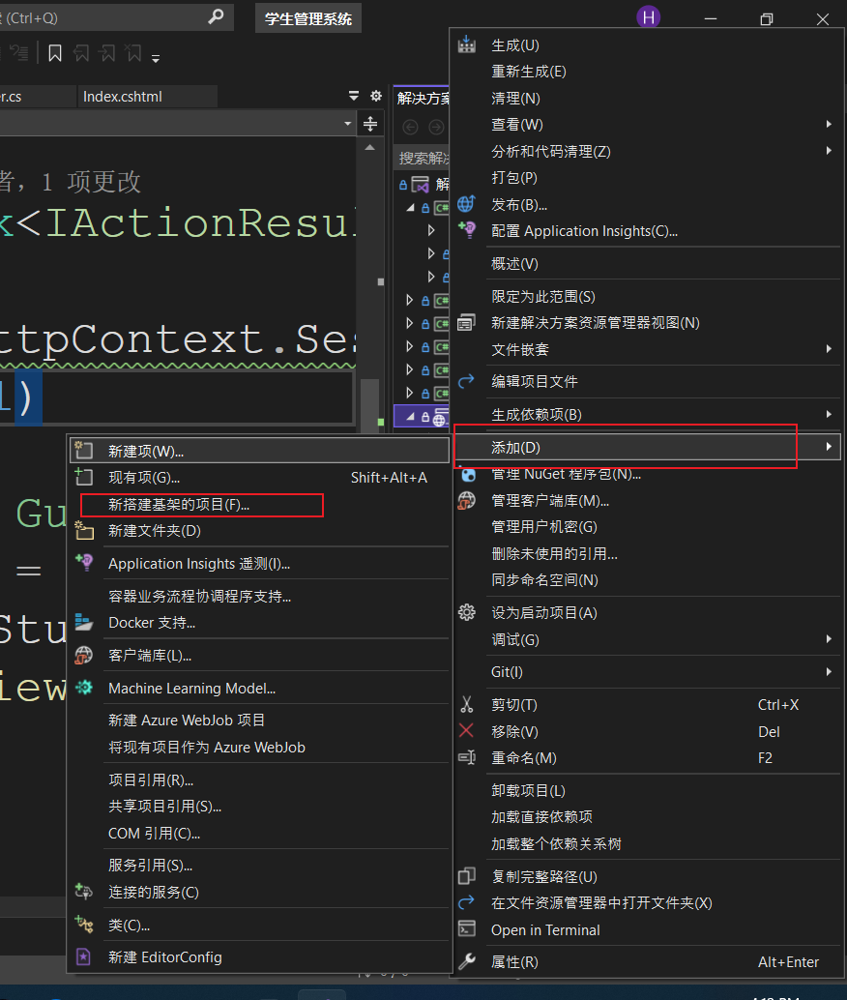

之后选择MVC区域

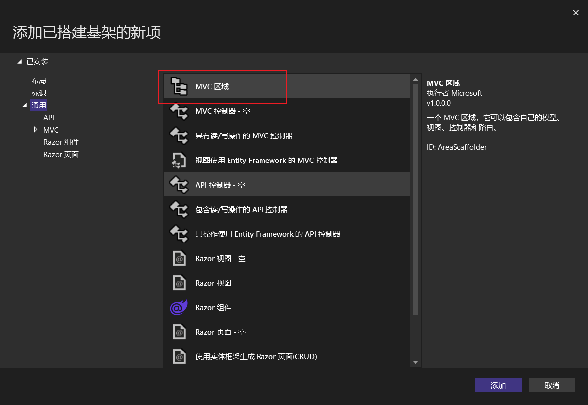

之后在新弹出的界面里输入一个域的名称,注意这个名称不要与项目,控制器等内容重名.

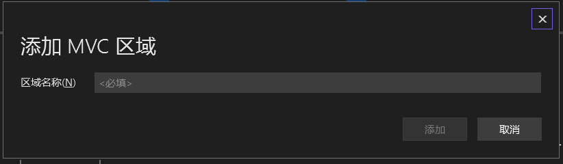

选择添加之后就会创建出对应的区域,这个区域就是让我们添加对应模块代码的,我们在其他的控制器下想要跳转进这个区域下的控制器中,需要额外进行配置.

在我们创建成功之后,在项目里会自动添加一个.txt文件,这个文件当中记录了该区域的路由配置信息,我们需要把这个信息复制到startup类当中原有的路由配置信息的下面

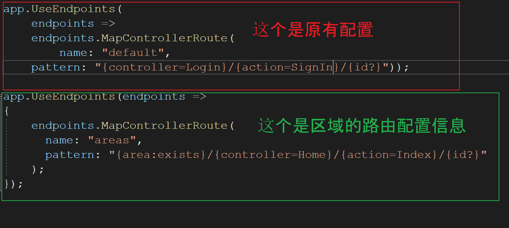

之后我们需要注意的是,在区域当中创建的任意一个控制器的上面都需要添加一个特性,用于标明该控制器属于这个区域

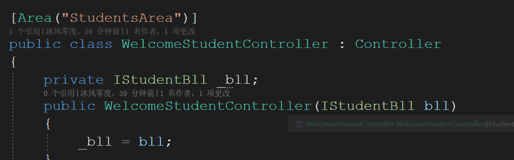

我们以后再去访问区域当中的页面时,一定要符合区域的路由配置,例如我们在上图的控制器当中添加一个Index视图,如果要访问我们需要输入下面的路径

https://localhost:5000/StudentArea/WelcomeStudent/Index

其中StudentArea为区域名,WelcomeStudent为控制器名,Index为方法名(视图名)

##### 6.7.8 Autofac

**什么是Autofac**

Autofac是一个非常优秀的.Net IOC框架,主要是让我们实现依赖注入功能,现在我们的.Net Core项目里面自带了一套依赖注入,但是这个依赖注入的功能并不是特别的强大,所以我们在外面真正的开发的时候大部分我们需要去额外安装这种框架来替换掉原有的.

**Autofac的使用**

步骤一: 我们需要去Nuget当中进行安装

我们一共需要安装两个包

(1) Autofac

(2) Autofac.Extensions.DependencyInjection

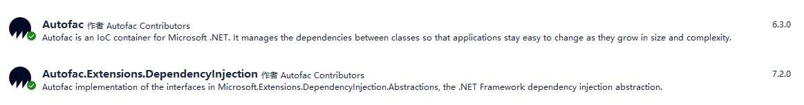

步骤二: 我们去Program.cs文件当中进行书写配置信息,要求需要写在 **var app = builder.Build(); 语句的上面.**

具体配置信息如下:

``` C#
using Autofac;
using Autofac.Extensions.DependencyInjection;
using System.Reflection; //这个是引入反射

var builder = WebApplication.CreateBuilder(args);
builder.Host.UseServiceProviderFactory(new AutofacServiceProviderFactory()); //把Autofac服务信息进行引入

builder.Host.ConfigureContainer<ContainerBuilder>(
   container => 
   Assembly assembly = Assembly.Load("实现类的命名空间名"); //通过反射找到这个命名空间
    container.RegisterAssemblyTypes(assembly).AsImplementedInterfaces().InstancePerDependency();
 //这个是注册我们通过依赖注入找到的命名空间里面所包含的所有类名,并且自己对应上这个类实现的接口,起到批量注册的功能   
); //开始进行依赖注入的注册(批量注入)
```

实战项目当中因为我们的项目当中有仓储层和服务层这两个都需要通过依赖注入来进行解耦,所以我们需要进行两次的批量注入,案例代码如下:

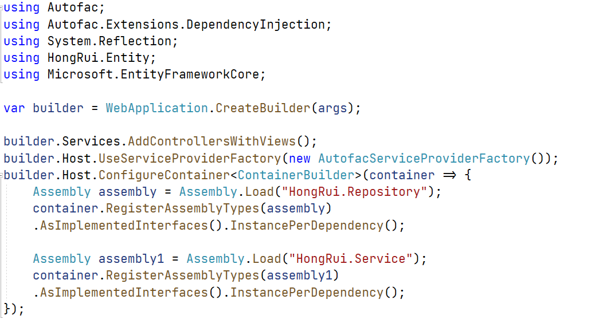

步骤三: 我们还需要去实现层当中添加一个返回程序集名字的类和方法

例如,我们在仓储层下创建一个ResopitoryCore的类,并且在里面添加如下的方法内容进行返回

``` C#
 public static string GetAssemblyName() 
        {
            return Assembly.GetExecutingAssembly().GetName().Name;  
        }
```

我们通过反射得到当前程序集信息,并且返回它的名字

只要书写上面的三步,我们就可以通过构造函数进行注入了

## 七. WebApi


# 2. Web前端框架

## 一. 弹性布局

现在常规网站的常规布局基本分为2种

(1) 固定布局: 这种很早的时候是我们做网站的比较常见的方式,好处是做的网站内容不会蹿版,但是问题也有

a. 当我们电脑的分辨率过大的时候,网页两边会有大量的留白存在

b. 当我们电脑的分辨率过小的时候,网页的页面内容显示不全

(2) 弹性布局: 这种布局是现在的主流,它会根据我们自己电脑的分辨的大小自动改变,实现这种布局的时候我们也有2种方式

a. 浮动+百分比布局 这种布局好处是网页内容可以自己适应浏览器的宽度,多种设备都可以适用

b. Flex布局 : 这个是我们现在设计网站的主流方式

#### Flex布局

Flex布局是CSS3引进的一种布局方式,我们管它叫做"弹性盒子模型",这种模型决定一个盒子在其他盒子中的分布方式以及处理可用的空间.

##### Flex 功能

* 在屏幕和浏览器窗口发生大小改变的时候,可以灵活的调整布局
* 控制元素在页面的布局方向
* 按照控制不同与DOM所指定排序方式对屏幕上的元素进行重新排序

##### Flex优势

* 可以让盒子里的元素排在一行
* 盒子里面元素的高度是相同的

##### Flex 语法

``` css
display:flex;
```

我们可以在父级容器的选择器当中添加如上的样式内容,代表我们这个容器下的内容采用的是flex布局.

Flex布局还带有如下的常用属性

| 属性            | 说明       |
| --------------- | ---------- |
| flex            | 伸缩性     |
| flex-direction  | 伸缩流方向 |
| flex-wrap       | 伸缩换行   |
| justify-content | 主轴对齐   |
| align-items     | 侧轴对齐   |

**(1) flex属性**

这个用于控制我们子元素在父级容器当中所在比例,语法如下:

``` css
flex:1; /*这个代表当前元素在父级容器当中占有1份空间,数值越大代表占有的空间越大*/
```

例如:

``` html
<!DOCTYPE html>
<html lang="en">
<head>
    <meta charset="UTF-8">
    <meta http-equiv="X-UA-Compatible" content="IE=edge">
    <meta name="viewport" content="width=device-width, initial-scale=1.0">
    <title>Document</title>
    <style>
        .box{ border:1px red solid; display: flex;}
        .first{ background: orange; height: 100px; flex:1;}
        .second{ background: pink; margin-left: 10px;  flex:2;}
    </style>
</head>
<body>
    <div class="box">
        <div class="first"></div>
        <div class="second"></div>
    </div>
</body>
</html>
```

效果如下:

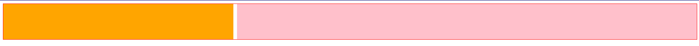

我们可以看到粉色背景的div是比橘色背景的div大的

> 注意: 我们浏览器对css3属性的支持不同,有的时候我们需要对这个属性添加浏览器兼容性的前缀

**(2) flex-direction属性**

这个属性是让我们控制伸缩流方向的,语法如下:

``` css
flex-direction: row | row-reverse | column | column-reverse;
```

我们可以看到属性值共分为2组,row代表的是横向排列,从左到右 带有reverse后缀的采取相反操作,从右向左排列,其中row是这个属性的默认这.

column代表的是纵向排列,从上之下的排列,带有reverse后缀的采取相反操作,从下到上的排列.

例如:

``` html
<!DOCTYPE html>
<html lang="en">
<head>
    <meta charset="UTF-8">
    <meta http-equiv="X-UA-Compatible" content="IE=edge">
    <meta name="viewport" content="width=device-width, initial-scale=1.0">
    <title>Document</title>
    <style>
        .box{ border:1px red solid; display: flex; flex-direction: row-reverse;}
        .first{ background: orange; height: 100px; flex:1;}
        .second{ background: pink; margin-right: 10px;  flex:2;}
    </style>
</head>
<body>
    <div class="box">
        <div class="first"></div>
        <div class="second"></div>
    </div>
</body>
</html>
```

效果如下:

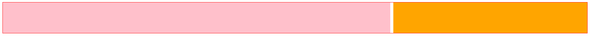

**(3) flex-wrap属性**

这个属性是控制我们子级元素在父级元素宽度不够的时候是否换行的,语法如下:

``` css
flex-wrap: nowrap | wrap | wrap-reverse;
```

其中nowrap是默认值,代表不换行

wrap代表换行

wrap-reverse 代表换行,但是这个是向上换行

**(4) justify-content属性**

这个属性是设定我们子级元素在父级容器当中如何横向布局的,布局方式一共有5种,分别如下:

| 属性值        | 说明                                                         |
| ------------- | ------------------------------------------------------------ |
| flex-start    | 向一行的起始位置靠齐                                         |
| flex-end      | 向一行的结束位置靠齐                                         |
| center        | 向一行的中间位置靠齐                                         |
| space-between | 平均分布在行内,第一个伸缩项目在一行的最开始,最后一个伸缩项目在一行的最终点 |
| space-around  | 平均分布在行内,两端保留一半空间                              |

**(5) align-items属性**

这个是让我们设定子级元素在父级容器当中垂直分布的,它也有5个属性值

| 属性值     | 说明                                     |
| ---------- | ---------------------------------------- |
| flex-start | 在侧轴起点的外边距紧靠该行在侧轴起始边   |
| flex-end   | 在侧轴终点边的外边距紧靠该行在侧轴终点边 |
| center     | 外边距盒子在该行的侧轴上居中放置         |
| stretch    | 拉伸填充整个伸缩容器,这个是默认值        |
| baseline   | 根据第一行的文字的基线对齐               |

#### 响应式布局

响应式网页设计(RWD, Responsive Web Design) 这个是由Ethan Marcotte(伊桑·马科特) 提出,它将现在已有的三种开发技术整合起来,并且命名的.

这三种技术是: a. 弹性布局 b. 弹性图片 c. 媒体和媒体查询

弹性布局上面我们说了

弹性图片是指不给图片设定固定尺寸,而是根据流体网格进行缩放,用于适应各种网格的尺寸.实现方法是比较简单的,一句代码就能搞定.代码如下:

``` css
img{max-width:100%;}
```

##### 媒体查询

**(1) 媒体类型**

在CSS2中我们常遇到的媒体类型是

* All  全部
* Screen  屏幕
* Print  页面打印或者打印预览模式

实际上媒体类型不止这三种,W3C共列出了10种媒体类型

| 值         | 设备类型                                        |
| ---------- | ----------------------------------------------- |
| All        | 所有设备                                        |
| Braille    | 盲人用点字法触觉回馈设备                        |
| Embossed   | 盲人打印机                                      |
| Handheld   | 便携设备                                        |
| Print      | 打印用纸或打印预览视图                          |
| Projection | 各种投影设备                                    |
| Screen     | 电脑显示器                                      |
| Speech     | 语音或音频合成器                                |
| Tv         | 电视机类型设备                                  |
| Tty        | 使用固定密度字母栅格的媒介,比如电传打字机和终端 |

我们根据设备的内容来进行选择,常用的是all和screen

**媒体类型的引入方式**

我们有两种方式进行引入

(1) 在样式表当中通过@media方式进行引入,语法如下:

``` css
@media 媒体类型{
    选择器{样式代码}
}
```

(2) 在我们html页面通过link引入样式表的时候进行引入,语法如下:

``` html
<link rel="stylesheet" href="样式表的路径" media="媒体类型" />
```

我们比较常用第一种方式

**(2) 媒体特性**

媒体特性是CSS3对媒体类型的增强版,我们可以把媒体特性看成是

> "媒体类型(判断条件)" + CSS(符合条件的样式规则)

媒体特性包含如下内容:

| 属性          | 值                                  | Min/Max | 描述               |
| ------------- | ----------------------------------- | ------- | ------------------ |
| device-width  | Length                              | Yes     | 设置屏幕的输出宽度 |
| device-height | Length                              | Yes     | 设置屏幕的输出高度 |
| width         | Length                              | Yes     | 渲染界面的宽度     |
| height        | Length                              | Yes     | 渲染界面的高度     |
| Orientation   | Portrait(纵向) 或者 landscape(横向) | No      | 横屏或竖屏         |
| Resolution    | 分辨率(dpi/dpcm)                    | Yes     | 分辨率             |
| Color         | 整数                                | Yes     | 每种颜色的字节数   |
| color-index   | 整数                                | Yes     | 色彩表中的色彩数   |

语法如下:

``` CSS
@media 媒体类型 and (媒体特性){
    CSS样式
}
```

其中我们看到了 and 关键字,这个代表并且,是要求同时满足这两者时才生效的,例如:

``` css
@media screen and (max-width:1200px){} /*这个代表了是电脑屏幕并且最大宽度为1200像素的才能使用里面的样式*/
```

我们还可以在媒体类型的前面添加not 关键字,用于排除某种指定的媒体类型,例如:

``` CSS
@media not print and (max-width:1200px){}/*这个代表了排除打印设备,并且最大宽度为1200像素的才能使用里面的样式*/
```

响应式布局的优缺点如下:

* 优点: 
  * 面对不同的分辨率设备灵活性强, 能够快捷解决多设备显示使用问题
  * 更少维护,开发一个网站,多终端可以使用
*  缺点:
  * 兼容各种设备工作量大
  * 代码累赘,会出现隐藏无用的元素,加载时间长

根据上面的优缺点我们找到了更加合理的网站设计方式 ----- 前端框架

例如: Bootstrap, LayUI, Vue 等等,自带响应式布局

## 二. Bootstrap

#### 1. 简介

##### 1.1 初始Bootstrap

Bootstrap框架是由Twitter设计师Mark Otto和Jacob Thornton共同开发出来的,准确的讲它就是一个HTML+CSS的前端框架.

Bootstrap框架提供了优雅的HTML+CSS规范,是由动态CSS语言完成的,它完美的解决了页面响应式设计的难点.因此该框架推出之后颇受欢迎.

> 什么是响应式设计?
>
> 上面笔记有此处略

##### 1.2 响应式设计四大原则

响应式设计需要遵循如下四个基本原则

* 移动端优先还是PC端优先
* 内容流
* 位图还是矢量图
* 相对单位还是固定单位

###### 1.2.1 移动优先还是PC优先

随着移动互联网的发展,很多小型创业企业甚至没有自己的网站,只有一个APP应用.在这个时代,网站项目是从小屏幕入手过渡到大屏幕,还是从大屏幕过渡到小屏幕,这个称为了企业考虑的首要问题.

在传统的大企业改造型网站,大部分是从大屏幕过渡到小屏幕的,而且在过渡到小屏幕的时候会碰到一些限制,比如:设法在第一页面显示更多的内容.

在新兴的创业公司,通常情况下都会从两个方面同时着手,所以具体哪个优先还是要看哪种方式最为合适.

###### 1.2.2 内容流

随着移动端屏幕尺寸越来越小,内容所占的垂直空间会越来越多.也就是说,内容会向下方延伸,这被称为"内容流".

###### 1.2.3 位图还是矢量图

首先我们先来说一下什么是位图,什么是矢量图

位图: 当一张图片被放大会出现比较虚的情况,这种图片被称为位图.

矢量图: 当一张图片被放大后不变虚的则为矢量图.

矢量图是使用线段和曲线描述图像,所以称为矢量,同时图形也包含了色彩和位置信息.

位图是使用像素点来描述图像的,计算机的显示器屏幕就是一张包含大量像素点的网格.在位图中,图像由每一个网格中的像素点的位置和色彩值来决定,每一点的色彩是固定的所以放大后观看图像时,每一个小点看上去就像是马赛克,这就是我们常说的"虚".

在响应式设计中,如果我们的图标使用了很多细节,并且应用了很多华丽的效果这种情况就是用位图.否则考虑矢量图.如果是位图,使用jpg,png或gif.矢量图则最好使用SVG或图表字体.

矢量图的优缺点:

优点:  通常比较小,非常适合移动端来展示

确定:  对浏览器的支持不是特好,老的浏览器不支持矢量图.

###### 1.2.4 相对单位还是固定单位

传统的设计单位有px,pt,cm等, 这些都是固定单位,没法实现跨平台展示.那么在这种情况下,百分比等相对单位就到了发挥作用的时候了.使用百分比时,我们所说的宽度50%是表示宽度占屏幕大小的一半.

##### 1.3 Bootstrap设计目标

其实从Bootstrap3版本开始,Bootstrap框架就包含了贯穿于整个库的移动设备优先的样式.Bootstrap 4版本默认的CSS本身就是对移动设备优先进行友好的支持.

Bootstrap框架的设计目标从优先支持桌面端转变到了优先支持移动端的设备.          

#### 2. 开发环境

##### 2.1 下载安装包

首先我们需要到官网网站进行在下开发包

官方网址是: [https://v4.bootcss.com](https://v4.bootcss.com/)

进入该网址之后,点击页面上的下载即可下载开发包.

##### 2.2 Bootstrap开发包目录结构

我们把下载好的开发包解压之后,就能看到里面包含了css和js两个文件夹,他们分别代表了编译好的样式文件和脚本文件.

css文件夹内包含的文件如下:


js文件夹内包含的文件如下:

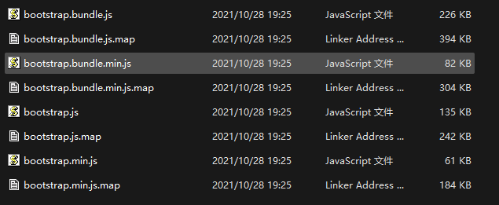

##### 2.3 在页面内引入Bootstrap框架

当我们在自己的项目下想要使用Bootstrap的时候,需要在代码页面内引入框架的样式和脚本

具体引入方式如下:

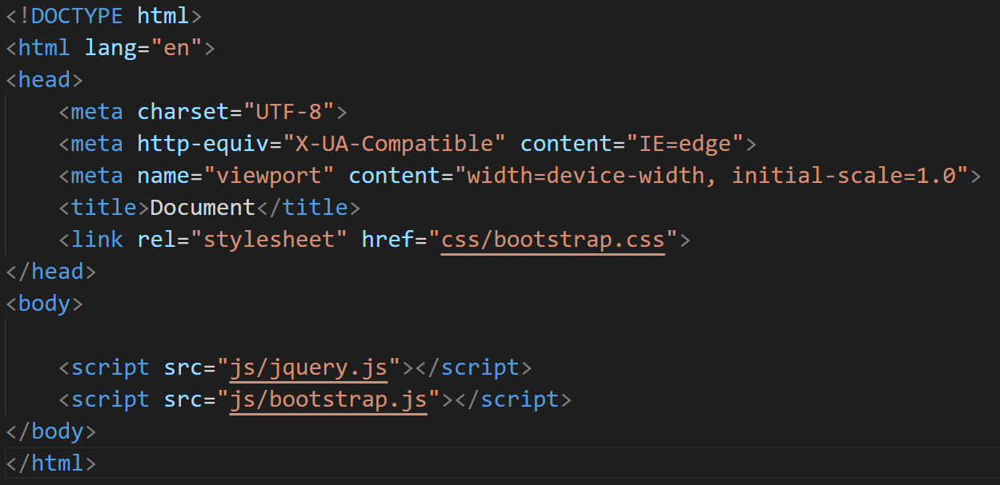

我们需要注意的地方是: 在引入Bootstrap的js文件前,必须先引入jquery的脚本文件否则会报错.,当我们在页面内如上引入了内容,就可以在这个页面里来使用bootstrap框架的样式了.

#### 3. Bootstrap脚手架

脚手架:英文原名Scaffolding,好多的中文翻译为脚手架,也有人翻译成基础架构的.它实际就是网页的整体模板和架构.

##### 3.1 Bootstrap全局样式

######  什么是全局样式

所谓的Bootstrap全局样式,其实就是通过Bootstrap框架为页面设置的全局CSS样式表.该全局样式表包括基本的HTML元素样式以及栅格系统,可以增强页面及其元素的CSS效果.

Bootstrap框架为屏幕,排版和链接设置了基本的全局样式,具体定义在了Bootstrap源码包scss文件夹中的_variables.scss文件中,我们可以打开这个文件阅读这些代码进行参考(注:这些代码是以scss来进行编写的),多读这些源码对我们的前端开发有好处.

##### 3.2 栅格系统

栅格系统是Bootstrap框架的一大特色,通过使用栅格系统使得页面布局更简单,更合理,更美观,更易于维护.

Bootstrap框架默认的栅格系统最多为12列,形成一个960px宽的容器,默认就是响应式布局特性.栅格系统会根据可视窗口的宽度从540px到1140px进行自适应的动态调整.在可视化窗口宽度小于540px的时候,列将不再固定,并且会在垂直方向进行自动堆叠.

常用的样式有:

(1) 容器样式: container , container-fluid,其中container是固定宽度,会在网页的两端留有空白,而container-fluid是以百分比的形式布局的,不会有空白保留

(2) 行: row 代表在容器当中存在着一行的内容

(3) 栅格中的格: col-n, col-sm-n , col-md-n,col-lg-n 这个是我们栅格系统当中的栅格,根据中间的单词来确定针对于那种分辨率的设备,之后在n的位置上写对应的格数即表示占有几个栅格

sm小屏幕 , md 中屏幕, lg 大屏幕, col-n 这个代表的是超小屏幕 

(4) 偏移列

Bootstrap中支持偏移列,我们可以使用 offset-a-b类将列向右移动,其中a的位置需要我们填写屏幕大小,b的位置需要我们填写要偏移多少个栅格

例如: offset-md-3 在中屏幕分辨率下向右偏移3个栅格位置

##### 3.3 页面布局

Bootstrap框架设计了固定布局,流式布局,弹性布局等方式.默认是弹性布局.

###### 3.3.1 固定布局和流式布局

固定布局 container

流式布局 container-fluid

这两种上面我们介绍了,就不详讲了.

###### 3.3.2 弹性布局

弹性布局实际是CSS的一个特性,是一种当页面需要适应不同的屏幕大小以及设备类型时,确保元素拥有恰当行为的布局方式.Bootstrap也采用了这种布局方式,也有人称为弹性盒子.Bootstrap 4使用了一整套响应式FlexBox快速管理网格列,导航等组件的布局,对齐和大小.

> 注意: IE9及以下版本不支持弹性布局.

我们可以在元素上通过引入类选择器实现弹性布局例如:

``` html
<div class="d-flex">我是一个弹性盒子</div>
<div class="d-inline-flex">我是一个嵌入式的弹性盒子</div>
```

看到上面的代码我们知道,弹性盒子有2种模式:

(1) d-*-flex 

(2) d-*-inline-flex

其中*可以省略或者更换为任意的屏幕大小,例如:sm,md,lg等

## 三. ES 6

### 1. ES 6 的简介

> JavaScript的组成:  DOM , BOM , ECMAScript

ECMAScript 其实就是我们现在要讲的ES6  --> 其中的这6代表的是版本号

在2015年6月份,发布的es6的这个版本,在这之后所有的版本都是叫做es6

> 什么是ECMAScript?它与JavaScript的关系是?
>
> ECMAScript 是由国际标准化组织ECMA对JavaScript语言设定的一系列标准
>
> ECMAScript与JavaScript的关系是: 前者是后者的规范,后者是前者的一种实现方式

### 2.  let 和 const 命令

#### 2.1 let 命令

这个命令是es6当中新增的内容,主要用于声明变量. 它的用法基本与var类似,不同点是 let声明的变量只能在let命令所在的代码块内有效. **let声明的变量都是局部变量**

声明变量的语法:

``` JavaScript
var 变量名 = 值;
let 变量名 = 值;
```

**在ES6的语法当中,提倡使用let命令进行创建变量,而不是使用var命令**

> var 与 let 声明的变量除了上面的不同点以外是否还有不同点?
>
> 有, **不存在变量提升**, 我们使用var创建的变量如果在创建之前就去使用了,那么这种情况下,会提示这个变量并没有被初始化(undifined) , 我们使用let创建的变量,则会直接报错

阅读下面的代码说出执行后的结果

``` javascript
var temp = 1111;
if(true){
    temp = 2222;
    let temp;
    console.log(temp);
}

```

答: 报错,上面这种情况我们一般管他叫做 "暂时性死区"

**什么是暂时性死区**

只要块级元素作用域内存在let命令,他所声明的变量 就绑定到这个区域

**let命令在同一个作用域下不允许出现同名的变量**

#### 2.2 ES6 块级作用域

我们一般带有{ } 就叫做块级作用域 , **ES6当中允许代码块之间互相嵌套**

``` JavaScript
{{{let a = 10;}}}
```

 上面的写法我们叫做3层块级作用域

阅读下面的代码,说出最后运行结果是什么

``` javascript
{
    {
        {let a = 20;}
  		console.log(a);
 	}
}
```

上面代码执行后报错,

``` javascript
{
    {
        {let a = 10;}
        let a = 10;
        console.log(a);
    }
}
```

上面的代码执行后,会在控制台输出10,因为通过let命令创建的2个变量a,没在同一个作用域下

**块级作用域与函数声明**

``` JavaScript
if(true){
    function a(){
        
    }
}
```

上面的写法如果是在ES5的开发环境下,会报错,**ES5的环境要求函数必须是声明在顶级作用域下**

ES6的开发环境是允许这么写的,在块级作用域下声明的函数与let命令声明的变量类似,它只能在这个作用域下使用,出了这个作用域是找不到的

#### 2.3  do表达式

**块级作用域本质上就是一个语句,这个语句只是把多个操作封装在一起了,并且不带有返回值**

``` JavaScript
{
    let t = f();
    t = t * t + 1;
    function f(){
        return 3;
    }
}
```

我们在块级作用域外面想要得到t的值是否能得到?

答: 不能, 第一点变量t是在作用域下创建的局部变量,外面找不到, 第二点,作用域是不带有返回值的,所以也获取不到

**在ES6当中我们可以通过do表达式把这个作用域变成表达式,带有返回值内容**

``` javascript
function f() {
   return 3;
}
let a = do {
     let t = f();
     t * t + 1;
};
```

#### 2.4 const命令

这个命令创建的变量就是一个常量,**const命令与let命令一样,在同一个作用域下不可以存在同名的变量**

> 常量: 初始化之后,不可再去修改

### 3. 变量的解构赋值

要求: 创建3个变量a,b,c 并且分别给这三个变量赋值为1,2,3

ES6当中允许我们像下面这种创建变量并且赋值

``` javascript
let [a,b,c] = [1,2,3];
```

上面的中写法,可以从数组当中提取出对应的值,并且按照对应的位置赋值给对应的变量

上面这种写法属于"模式匹配",要求是等号两边的模式相同,左边的变量就可以被赋予对应的值

``` javascript
let [a , [[b] , c ]] = [1 , [[2] , 3]];  
```

我们在去输出a,b,c的时候是否会报错呢? 不会报错

我们除了上面的写法以外,还可以在创建的时候同时给对应的变量指定一个默认值

``` JavaScript
let [a , b = 100] = [50]; 
```

阅读下面代码说出最后执行的结果是

``` javascript
let [a , b = 'B' ] = ['A', undefined];
```

这个地方会输出 A, B ,其中b在赋值的时候给的是undefined代表未定义,就是不给B进行合理的存值,那么b变量就会存入默认值

阅读下面代码说出最后执行的结果是

``` javascript
let [a = b , b = 2] = [];
```

阅读下面的代码说出最后执行的结果是

``` javascript
let [a = 1, b = 2] = [3 , null];
```

**对象的解构赋值**

解构不仅可以通过数组的形式来进行存值,还可以通过对象的形式进行存值

``` javascript
let {a,b} = { a:1, b:2 };
```

阅读下面的代码说出最后执行的结果是

``` javascript
let {a : 1 , b : 2} ={a:3}; 
```

上面的这个东西报错, : 后面不能直接指定准确的内容, : 后面只能存放变量,而且只能有一个声明,不能是多个声明

``` JavaScript
let {a : b} = { a: 1 , b:2};
```

我们在这个代码后面只能通过输出b得到结果,如果我们输出a,则会报错,提示a未定义,但是存储的值还是以我们后面赋值时对应名称的值为主,上面的这段代码最后的输出结果是1,我们后面b:2这段代码是用于给a设定默认值为2的,但是b这个变量在上面并没有真的声明,所以:b 并不会把真的值存入到a, 而是会因为b没有声明,存入undefined

**对象的解构赋值的内部机制是先找到同名属性,然后再去赋值给对应的变量.真正被赋值的是后者,而不是前者**

对象的解构赋值嵌套

``` javascript
let obj = {
  pre : [
      "Hello",
      { aft : "world" }
  ] 
};
```

上面的这种写法就是我们S2讲过的Json字符串的写法, { }里面用于设定key和value,上面代码当中key为 pre, 值是:后面的内容, { }里面只能存放一个属性 , [ ] 相当于我们存放的数组值,里面可以存放多个内容

上面的变量obj经过3次解构赋值

### 4. 字符串的扩展

#### 4.1 字符的Unicode表示法

在ES6中加强了对Unicode的支持,并且扩展了字符串.

JavaScript当中允许我们使用\uxxxx形式表示一个字符,其中xxxx表示字符的unicode码点.

例如: \u0061 这个代表的是字母 a

上面的这种表示法只限于码点在\u0000 ~ \uFFFF之间的字符,如果超出这个范围的字符,必须采用2个双字节的形式表达

#### 4.2 codePointAt()

JavaScript内部,字符以UTF-16的格式存储,每个字符固定为2个字节.对于那些需要4个字节存储的字符(Unicode码点大于0xFFFF的字符),JavaScript会认为它们是2个字符

``` Javascript
let s = "吉";

s.length;
s.charAt(0); //
s.charAt(1); //
s.charCodeAt(0);
s.charCodeAt(1);
s.codePointAt(0);
```

#### 4.3 String.fromCodePoint

让我们把编码格式的内容转换成对应的字符 ,这个方法是ES5提供,这个方法不能识别32位UTF-16

的字符

``` JavaScript
let a = "0x20BB7";
console.log(String.fromCodePoint(a));
```

这个方法我们可以传递多个参数,他会把这些值合并成一个字符串进行返回

#### 4.4 字符串的遍历器接口

原始玩法:

``` JavaScript
   let a = "Hello World";
   for (let i in a) {
      console.log(a[i]);
   }
```

在ES6当中,为字符串添加了一个遍历器接口,我们可以通过这个接口内容直接遍历出字符串的每个字符

使用的语法还是循环,但是循环语法变了

``` javascript
for(let 变量名 of 要遍历的字符串名字){
    console.log(变量名);
}
```

#### 4.5 at函数

功能与charAt()相同,主要得到字符串当中某个字符

``` JavaScript
字符串变量名.at(要得到字符的索引)
```

> at函数与charAt函数的区别:
>
> charAt函数返回的内容是UTF-16编码当中的某个字节,当我们的内容Unicode编码大于0xFFFF的时候是无法正常显示的,但是at函数可以

#### 4.6 模板字符串

原始玩法:

``` javascript
let str = "";

for(....){
    
    str += "<tr>";
    ...
    str += "</tr>";
}


```

在ES6当中认为上面的写法太过于繁琐,所以引进了模板字符串

``` javascript
let str = "";
for(....){
    
    str += `
       <tr>
           <td>${data[i].title}</td>
	   </tr>
    `;}
```

### 5. 函数的扩展

#### 5.1 函数的默认值

正常函数的声明

``` javascript
function 函数名([参数列表]){
    函数内容
    [return xx;]
}
```

例如:

``` javascript
function calc(x,y){
    console.log(x+y);
}

calc(1,2);

```

当我们方法某个参数因为值比较固定,大部分的时候是不需要存储,使用默认值即可,但是特殊情况下我们还需要

进行存值操作的,我们就可以按照下面的方式进行声明函数

``` javascript
function calc(x,y = 5){
    
}
```

**带有默认值的参数必须放到参数列表的最后面**

#### 5.2 rest 参数

这个参数就是C#当中多个参数值(params)

``` javascript
function 函数名(...参数名){
    //我们在函数内部想要使用这个参数,需要循环遍历,它会以数组的形式进行操作
}
```

只要看到上面这种形式的声明方式,代表我们可以在参数上传递多个值

> js当中的数组是否可以一次通过push方法添加多个值进入数组

**要求带有rest修饰的参数,必须是参数列表当中的最后一位**

#### 5.3 箭头函数

ES6 是允许我们使用 => 来定义函数的,我们通过这种方式定义的函数,默认是带有返回值

语法:

``` js
let 变量 = function(){
    return ...;
}

//上面的写法是正常的写法,箭头函数的写法如下
let 变量 = () => ...;

```

例如:

``` js
let sum = function(x,y){
    return x+y;
}

//转变为箭头函数
let sum = (x,y) => x+y;

```

上面的写法是当我们的函数里只存在一条语句的写法,如果说我们的函数当中存在着多条语句,那么箭头函数该如何写

``` js
//现在我们要求传递2个参数值,并且计算这两个数字的和与差,之后返回这两个值
let v = function(x,y){
    let sum = x + y;
    let c = x - y;
    return [sum,c];
}
//把上面的内容转换为箭头函数

let v = (x,y) => { 
	let sum = x + y;
    let c = x - y;
    return [sum,c];
}
```

#### 5.4 尾调用优化

##### 5.4.1 尾调用

尾调用是函数式编程的一个重要概念,它是指在某个函数的最后一步的时候调用另一个函数.

例如:

``` js
function show(x){
    return a(x);
}
```

> 阅读下面代码说出哪个(哪些)不是尾调用
>
> ``` js
> function f(x){
>     let y = g(x);
>     return y;
> }
> 
> function f(x){
>     return g(x) + 1;
> }
> 
> function f(x){
>     g(x);
> }
> 
> ```
>
> 上面三种当中没有一个属于尾调用
>
> 第三种不带有返回值的函数,我们要把所有的代码写全是如下效果:
>
> ``` js
> function f(x){
>     g(x);
>     return undefined;
> }
> ```
>
> 下面的这种写法是否为尾调用
>
> ``` js
> function f(x){
>     if(x > 0)
>         return m(x);
>     return k(x);
> }
> 
> ```
>
> 这种写法是属于

##### 5.4.2 优化

举例:

``` js
function f(){
    let m = 1;
    let n = 2;
    return g(m+n);
}

f();

//等同于
function f(){
    return g(3);
}
f();

//等同于
g(3);
```

上面代码当中,如果函数g不是尾调用,函数f就需要保存内部变量m和n的值,g的调用位置等等信息.

但是我们现在的写法调用g函数之后,函数f就结束了,所以执行到最后一步时,就完全可以删除掉f函数的调用,只要我们能够找到g函数的调用即可,这种操作就是尾调用的优化.

> 什么是尾调用优化?
>
> 只保留内层函数的调用,这种写法叫做尾调用优化

> 尾调用优化的优点?
>
> 因为我们使用尾调用优化时,每次只需要调用一项,这种写法会大大的节省内存

### 6. 数组的扩展

> apply与call函数的区别
>
> 两个方法都是用于更改this指向的
>
> apply方法的第二个参数让我们来进行传递数组形式的值进行展现
>
> call 方法的第二个参数让我们来进行传递正常形式的参数内容

#### 6.1 替换数组的apply方法

就是把我们现在数组内容展开不需要再去使用apply方法了,我们使用类似于rest参数的形式来进行更改

``` js
var arr = [1,2,3,4,5,6];
function add(x,y,z){
    //arr.push(x,y,z);
    //我们现在要求是通过这个方法把参数的值传递(添加到)给我们指定的数组
}

add.apply(null,arr); //这个地方让我们通过apply方法来进行指定,指定add方法当中的this对象是arr数组

//ES6的写法

function add(x,y,z){
    
}
var arr = [1,2,3];
add(...arr); //这个就是es6当中指定当前函数里this对象代指arr数组的意思

```

#### 6.2 扩展运算符的应用

**合并数组**

``` js
var a = [1,2,3,4];
var b = [5,6,7,8];
//我们需要把上面两个数组合并之后,再去进行循环遍历输出
a.concat(b); // ES5的写法 ,通过concat方法来实现数组的拼接

var c = [...a,...b]; //ES6的写法,通过rest参数形式来进行拼接
```

**函数的返回值**

``` js
//设定一个函数,函数的参数传递进去一个数组,我们要求返回这个数组当中大于9的所有数字
 function getNum(...arr) {
       var sum = [];
       for (let i of arr[0]) {
           if (i > 9) {
              sum.push(i);
           }
       }
       return sum;
 }
```

#### 6.3 Array.from()

该方法可以把类似于数组的对象转换为真正的数组对象

例如:

``` js
let haha = {
            "0": "张三",
            "1": "李四",
            "2": "王五",
            "3": "马六",
            length: 4
        };
        console.log("原始的:");
        console.log(haha);
        console.log("转化后:");
        console.log(Array.from(haha));
```

#### 6.4 Array.of()

这个方法是让我们把一组值转换为数组

例如:

``` js
let a = 1;
let b = 2;
let c = 3;
Array.of(a,b,c);
```

Array.of 基本上可以用来代替Array() 或者 new Array(),并且不存在因为参数不同而导致的重载,它的行为非常统一

#### 6.5 copyWithIn()

数组实例当中通过copyWithIn方法会在当前数组内部将指定位置的成员复制到其他位置上,并且会覆盖掉这个原有成员.,返回值为当前数组

例如:

``` js
let arr = [1,2,3,4,5];
//数组名.copyWithIn(target,start,end)
//target       从该位置开始替换数据
//start(可选)   从该位置开始读取数据,默认为0,,如果值为负数了,则表示倒数 
//end(可选)     到该位置前停止读取数据,默认等于数组长度,如果值为负数了,则表示倒数
arr.copyWithIn(0,2,3); //这个位置就是把值进行替换了,数组更改为[3,2,3,4,5]

arr.copyWithIn(0,3); //这个的输出结果是? // [4,5,3,4,5]

```


### 7. 对象的扩展

#### 7.1 简介的表示法

ES6允许直接写入变量和函数作为对象的属性和方法.

ES5之前的写法

``` js
var foo = 'haha';
var obj = {foo};
console.log(obj);
```

ES6的写法:

``` js
var obj = { foo : "haha"};
```


ES5之前的方法返回对象的写法:

``` js
function fuc(x,y){
    return { x:x,y:y };
}
```

ES6的写法:

``` js
function fuc(x,y){
    return {x,y};
}
```

ES6当中如果对象我们只写了属性名,并没有写属性值,这个时候,属性值等于属性名所代表的变量

> 当我们创建一个对象时,这个对象既包含属性,又包含方法,我们该如何声明

``` js
var person ={
    name:"张三",
    age:16,
    gender:"男",
    show:function(){
        //方法具体内容
    }
};
```

上面的内容可以简化为下面的写法

``` js
var person ={
    name:"张三",
    age:16,
    gender:"男",
    show(){
        //方法具体内容
    }
};
```

#### 7.2 属性名表达式

JavaScript当中语言定义对象的属性有两种方式:

(1) 

``` js
obj.name = "";
```

(2)

``` js
obj["na"+"me"] = "";
```

第一种方式时直接用标识符作为属性名,第二种时用表达式作为属性名,这时要将表达式放在中括号当中

当我们使用的时ES5的时候,我们一般不会用到上面的两种,而是采用花括号的方式进行定义属性.

我们使用花括号形式的时候,ES5里面只能使用 第一种方式的形式创建属性

``` js
//ES5
var obj ={
    name:"",
    age: 16 ,
};
```

ES6允许我们定义属性时采用第二种方式定义

``` js
var obj ={
    ["na"+"me"] : "",
    age : 16
}
```

#### 7.3 Object.is()

ES5当中用于比较两个值是否相等,只有两个运算符 相等运算符(==)和严格相等运算符(===).

它们都有缺点: == 会自动转换数据类型,===的NaN不会等于自身,以及 +0 等于 -0

ES6当中提出"Same-value equality"(同值相等)算法来解决这个问题. Object.is就是部署这个算法的新方法,它用来比较两个值是否严格相等的,与===的行为基本一致.

语法:

``` js
Object.is(a,b)
```

#### 7.4 \__proto__属性

这个是用来读取或者设置当前对象的prototype对象.

``` js
var obj = {
    method:function(){ ... }
};
obj.__proto__ = ...;    
```

ES6当中当某个属性前后都带有了双下划线,这样的属性我们叫做内部属性,并不是对外公开的

**Object.setPrototypeOf()**

这个函数作用与我们上面的\__proto__这个属性相同,用来设置一个对象的prototype对象,返回参数对象本身/

``` js
Object.setPrototypeOf(object,prototype);
```

例如:

``` js
var o = Object.setPrototypeOf({},null);
```

### 8. Symbol

Symbol这个是ES6引进的一种新的原始数据类型,表示独一无二的值.

> JavaScript 我们之前讲了几种数据类型,分别是什么?
>
> 我们之前一共讲了6种,Undefined,Null,boolean , string , number ,object

Symbol这个是我们讲的js当中第7种数据类型

#### 8.1 Symbol变量的声明

语法:

``` js
let 变量名 = Symbol();
```

这种数据类型比较特殊,它是通过函数进行声明的

**我们该如何赋值呢?**

``` js
let s =  Symbol('haha'); //这个代表我们声明了一个Symbol类型的变量s,并且赋值为haha
```

> 我们现在声明的Symbol类型变量是否为一个对象
>
> 不是一个对象,所以Symbol类型的内容是不带有属性的,我们可以把这种数据类型看做成一种类似与字符串类型的数据类型

**判断两个Symbol数据类型的值是否相等**

**就因为symbol要求是独一无二的,所以我们写的2个函数的返回值都是不相同的**

案例1:

``` js
let s1 = Symbol();
let s2 = Symbol();
console.log(s1 == s2);  //false
console.log(s1 === s2); //false
```

案例2:

``` js
let s1 = Symbol('haha');
let s2 = Symbol('haha');
console.log(s1 == s2);  //false
console.log(s1 === s2); //false
```

**Symbol数据类型的值是不可以与其他数据类型的值进行运算的,否则会报错**

#### 8.2 作为属性名

由于每一个symbol变量的值都是不同的,所以我们可以把这种变量的值当作标识符用于对象的属性名.

实例:

``` js
let sss = Symbol();
//第一种写法:
var a = {}; //代表创建一个对象
a[sss] = 'Hello'; //给这个对象添加一个属性,属性名是上面创建的Symbol变量值,值是hello

//第二种写法:
var a = {
  [sss] : "hello"  
};


```

#### 8.3 实例: 消除魔术字符串

魔术字符串: 在代码中多次出现,与代码形成强耦合的某一个具体的字符串或者数值.

**我们在良好的代码开发当中,应该尽量消除魔术字符串,使用含义清晰的变量代替**

``` js
function getArea(shape,options){
    var area = 0;
    switch(shape){
        case 'Triangle': //这个地方我们就叫做魔术字符串
            area = 0.5 * options.width * options.height;
            break;
         ....   
    }
}
```

上面的代码当中出现了Triangle变量值,它就是一个魔术字符串.它会出现多次,与代码形成了"强耦合",不利于我们后期的修改和维护.

我们需要把上面的魔术字符串消除,最常用的方式就是把魔术字符串变成一个变量

代码更改为:

``` js
var shapeType={
    triangle : 'Triangle'
};

function getArea(shape,options){
    var area = 0;
    switch(shape){
        case shapeType.triangle: 
            area = 0.5 * options.width * options.height;
            break;
         ....   
    }
}


```

### 9. Set和Map数据结构

#### 9.1 Set数据结构

Set是ES6提供的新的一种数据结构,,它类似于数组,但是成员的值都是唯一,没有重复.

``` js
let s = new Set(); //这个代表我们创建了一个新的set结构

let s = new Set([1,2,3,4,5,6]); //这个是我们创建了set结构,并且存储了值
```

阅读代码说出结果

``` js
let items = new Set([1,2,3,4,5,5,5,5,5]);
console.log(items.size); //size是set结构的属性,用于得到set结构的长度
```

#### 9.2 Set实例的属性和方法

##### Set的属性

(1) Set.prototype.constructor : 构造函数,默认就是Set函数

(2) Set.prototype.size : 返回Set结构当中成员的总数

##### Set的方法

分为两种方法,操作方法(用于操作Set当中的数据的)和遍历方法(用于遍历Set当中的成员的)

add(value)     给set结构当中添加某个值的,返回Set结构本身

delete(value) 删除某个值,返回一个布尔值,用于表示是否删除成功

clear( )            清除掉Set结构当中所有的成员,没有返回值

has(value)      用于判断value的值是否为Set成员,返回布尔值

> 创建一个Set集合,往里存储几个学生姓名,如果其中包含 张三,我们就去删除他

##### 遍历操作

keys()       返回键名的遍历器

values()    返回键值的遍历器

entries()   返回键值对的遍历器


**因为Set结构并没有键名,只有键值,所以Set结构当中键名和键值都是同一个值,就是键值**

也是因为set当中只有values,所以我们一般不常用values方法而是直接通过for .. of的形式遍历Set结构

``` js
for(let item of set结构名){
    
}
```

forEach()  使用回调函数遍历每个成员

forEach() 用于遍历每个成员,并且执行任意操作,但是这个方法是不带有返回值的

``` js
let s = new Set([1,2,3,4]);

s.forEach(v => console.log(v*2)); //2,4,6,8
```

##### 交集,并集,差集

并集:就是把2个Set集合合并到一起

``` js
let a = new Set([1,2,3]);
let b = new Set([4,5,6]);
//并集就是把 a,b放到一起形成一个新的集合
let union = new Set([...a,...b]);
```

交集: 就是2个集合当中共同存在的内容

``` js
let a = new Set([1,2,3]);
let b = new Set([4,3,2]);
let c = new Set([...a].filter(v => b.has(v)));
```

filter这个是过滤方法,用于在某个集合当中筛选出 要求的值,小括号里我们需要书写一个箭头函数,这个箭头函数主要就是让我们填充过滤的条件

差集: 集合a当中的哪个值在集合b当中是不存在的

``` js
let a = new Set([1,2,3]);
let b = new Set([4,3,2]);
let c = new Set([...a].filter(v => !b.has(v)));
```

#### 9.3 WeakSet

WeakSet结构与Set结构类似,里面也是存储不重复值的集合.它与Set有两个区别

(1) WeakSet的成员只能是对象,而不能是其他类型的值

(2) WeakSet中的对象都是弱引用,弱引用就是垃圾回收机制不考虑WeakSet对该对象的引用.

语法:

``` js
let 变量名 = new WeakSet(要存储的对象内容);
```

**WeakSet再通过构造函数存值的时候只能接受一个数组或者类似数组的对象作为参数,换句话说只要是能够遍历都可以当作参数进行传递**

##### WeakSet方法

add()                向WeakSet实例添加一个新的成员

delete()           在WeakSet实例当中删除指定的成员

has()                判断某个值是否在WeakSet实例中存在

#### 9.4 Map数据结构

Map是JavaScript当中一个键值对的集合(Hash结构),其中键只能存储字符串的值

语法:

``` js
let m = new Map(); //这个是创建了一个Map集合,名字叫做m
```

Map集合也可以通过构造函数进行存值,它可以接受一个数组作为参数,该数组的成员是一个个表示键值对的数组

例如:

``` js
let m = new Map([
    ['name', '张三'],
    ['age', 16]
]);
```

##### Map属性

.size     用于获取集合当中的长度,**map集合当中键值对的数量**

##### Map方法

set(k,v )    用于给Map集合存值的 

get(k)       用于获取我们指定的key所对应的值 

delete(k) 用于删除我们指定的key所对应的键值对,返回布尔值,用于提示是否删除成功

has(k)      用于判断我们指定的key是否存在,存在返回true,不存在返回false

小练习:

``` js
let items = [
    ["stu1",{name:'张三',age:16,gender:"男"}],
    ["stu2",{name:'李四',age:16,gender:"女"}],
    ["stu3",{name:'王五',age:16,gender:"男"}]
];
let m = new Map(); //要求把上面数组当中的值通过set方法存储到m集合当中

// for (let item of items) {
//     m.set(item[0], item[1]);
// }
//items.forEach(x => m.set(x[0], x[1]));
items.forEach(([key, value]) => m.set(key, value));
```

> 如果我们给上面的map集合,stu1,在存储一个新的值,那么代码是否会报错呢?
>
> 不会报错,会把原有的值进行覆盖

> 我们是否可以通过一个set方法给map集合存储多个值,如果可以该如何书写
>
> 可以,代码如下:
>
> ``` js
> let m = new Map();
> m.set();
> //上面的写法我们可以简化一下
> let m = new Map().set("first", "aaa").set("second", "bbb");
> 
> ```
>
> 

##### Map 转数组

``` js
[...map集合名]
```

##### Map 转Json

``` js
let jsonstr =[
    {key:value,key1:value1,...},
    {key:value,key1:value1,...}, 
];
```

有2种情况

第一种情况: Map的键名都是字符串,这个时候我们可以选择转为对象JSON

``` js
//我们先声明一个Map集合转换为对象的方法
function strMapToObj(strMap) {
   let obj = Object.create(null); //创建一个空的对象
   for (let [k, v] of strMap) {
      obj[k] = v;
   }
   return obj;
}

//我们需要把上面的map集合转换成json
function strMapToJsonObj(strMap) {
   return JSON.stringify(strMapToObj(strMap));
}
```

第二种情况: Map集合的键名存在着非字符串的形式,这种可以选择转为数组Json

``` js
 //我们声明一个数组转换为json的方法
function mapToArrayJson(map) {
    return JSON.stringify([...map]);
}

```

##### Json转Map

正常情况下,所有的键名都是字符串

``` js
//我们需要先写一个对象转换成map的方法
function objToMap(obj){
    let m = new Map();
    for(let k of Object.keys(obj)){ //Object.keys(对象名) 是获取这个对象当中的所有属性名的
        m.set(k,obj[k]);
    }
    return m;
}

//我们还需要有一个把json字符串变成json对象的方法,之后调用上面的内容更改为map
function jsonToMap(jsonstr){
    return objToMap(JSON.parse(jsonstr)); //JSON.parse() 这个方法是把json字符串转换为json对象的
}
```

还有一种特殊情况,整个JSON就是一个数组,且每个数组成员本身又是一个具有2个成员的数组.

``` js
//我们直接把这些数组转换成Map即可
function jsonToMap(jsonstr){
    return new Map(JSON.parse(jsonstr));
}
```

### 10. Proxy

#### 10.1 简介

Proxy是用于修改某些操作的默认行为,等同于在语言层面做出修改,所以属于一种"元编程"(meta programming),就是对编程语言进行编程.

Proxy可以理解成在目标对象前架设一个"拦截"层,外界对该对象的访问都必须先通过这层拦截.我们可以把它叫做"代理器".

小案例

``` js
var obj = new Proxy({},{
    get:function(target,key,receiver){
      return Reflect.get(target,key,receiver);  
    },
    set:function(target,key,value,receiver){
        return Reflect.set(target,key,value,receiver);
    }
});
```

上面的代码我们对一个空对象进行了一层拦截,重定义了属性的读取(get)和设置(set)

> 51假期,抽时间把Proxy和Reflect百度一下去,放假回来上的时候我们主要讲这两个内容


### 11. Reflect


### 12. Promise对象


### 13. 修饰器


## 四. Vue


# 3. 数据库

## 一. Sql Server


## 二. MySql


## 三. PostgreSQL


## 四. Redis


## 五. MongoDb


# 4. 操作系统

## A. 程序员需要掌握的系统都有哪些?

Windows ,  Linux  , Windows Server (这个是只针对于服务器的系统) IIS

## Linux系统

Linux 是 1991年 Linus(林纳斯)研发出来的一个开源的,免费的操作系统.

之前Linux主要指的是 系统的核心,现在 泛指操作系统

它存在着多个发布版本(大部分的功能都是程序员或者黑客进行完善的)

(1) Red Hat(红帽子) 唯一个系统软件收费的

(2) Deepin  这个是国内开发的一个版本 界面特别的好看,存在着大量的预装软件

这个系统只是在Ubuntu系统上做了层"皮肤"

(3) Ubuntu  这个是最贴近于Windows的系统

(4) CentOS 这个是国内使用量最大的Linux发布版本,国内基本所有的服务器采用的

都是这个系统

(5) Debian  这个是国外服务器上架设 VPS系统的主流系统

> vpn与vps 之间的区别: 
>
> vpn 在国内架设一个虚拟服务器,通过这个让我们能够访问外网,现在是违法的
>
> 不要碰
>
> vps 这个是系统的一种类型,主要用于客户端与服务器之间的数据交互,它也能
>
> 实现访问外网,但是有个要求,你必须拥有一个国外的服务器

(6) Kali Linux  这个系统主要是做渗透用的,之前黑客在大量的使用. 

## 虚拟机

CentOS  系统镜像  4.4GB

VMware 虚拟机      500MB 

虚拟机官网: [VMware 中国 - 交付面向企业的数字化基础 | CN](https://www.vmware.com/cn.html)

我们需要下载的是VMware WorkStation  16  Pro   , 这个虚拟机是收费的,激活

如果我们电脑是Win10或者Win11,想要安装这个内容需要把电脑的Hyper-V 关闭了

Hyper-v : Windows 当中用于设置容器的

> 如何查看自己电脑Hyper-v是否关闭
>
> (1) win+r ,之后输入 control 回车 
>
> (2) 点击程序
>
> (3) 启动或者关闭应用程序
>
> (4) 查看Hyper-v前面是否存在对号,有就点掉

虚拟机安装步骤(略)

**什么是虚拟机**

在自己当前系统当中模拟出另一个系统,模拟出来的系统与我们现在原本的系统无关

> 两种系统镜像的扩展名: .iso , .img

CentOS(略)

系统安装完成之后,我们需要在电脑桌面打开终端

输入下面的指令,这个指令需要我们联网

``` shell
sudo yum -y update 
```

这是使用管理员权限更新系统所有配置

(1) 添加微软的信用包,让CentOS支持微软的内容

``` shell
sudo rpm -Uvh https://packages.microsoft.com/config/centos/7/packages-microsoft-prod.rpm
```

(2) 安装SDK

``` shell
sudo yum install dotnet-sdk-6.0
```

sudo 用于使用管理员权限操作后面的命令

yum 这个是CentOS 当中系统操作的命令,更新或者安装软件都需要使用它

(3) 安装运行时

``` shell
sudo yum install aspnetcore-runtime-6.0
```

> 如果我们通过sudo命令提示账号...不在sudoers文件夹里的,我们使用下面的\
>
> 命令进行切换用户(高级管理员)
>
> ``` shell
> su root
> ```

## Linux 基础命令

### 1. 查看当前目录下所有文件

``` shell
ls
```

上面的命令并不会查看隐藏文件

**查看所有文件包含隐藏文件**

``` shell
ls -a
```

隐藏文件是以.为开头的,我们观察到所有内容当中包含2种颜色,黑色代表的是文件,

蓝色代表的是文件夹

我们现在有个要求:要求列表形式展示显示文件

``` shell
ls -l
```

展示效果如下:

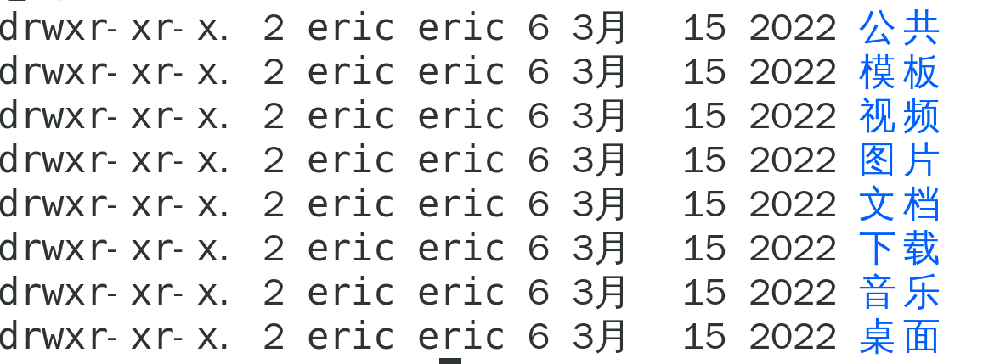

​     权限                           包含文件个数  创建用户  修改用户    日期       文件名 


我们现在要求以列表形式展示所有数据

``` shell
ls -la
```

### 2. 创建文件夹命令

``` shell
mkdir 文件夹名
```

### 3. 进入某个路径

``` shell
cd 对应路径
```

### 4. VI编辑器

这个是我们最近要经常用的一个内容,就是windows当中的记事本,能够编译任何文件,

这个编辑器是以控制台形式运行的

VI编辑器的工作模式:

VI编辑器包含三种模式: 命令模式 , 插入模式 , 底行模式

命令模式是我们刚打开VI编辑器的模式,主要是让我们进行命令操作

插入模式是让我们编辑文件的

底行模式是让我们对这个文件进行保存退出,或者强制退出操作的

命令切换插入: 按 i 键

插入切换命令: 按esc

命令切换底行: 按冒号:

底行切换命令: 按esc

作业: 1. 安装虚拟机

         2. 安装.net sdk 和 运行时
            3. 通过dotnet cli 创建控制台程序

``` shell
dotnet new console
dotnet run
```

4.  完成下列代码要求:

1.  1,1,2,3,5,8,... 求第30位

2.  求 1990年到现在一共有多少个闰年

3.  创建一个10个长度的int类型数组,手动存值,并且实现冒泡排序

4.  创建一个字典集合,key为string类型,value为int类型,要求实现通过key模糊查询,

   输出值

5.  创建一个Person类型通过委托形式实现中国人,日本人,美国人,法国人的问号

    方法

我们提交作业的时候交截图,每个都有代码截图,运行效果结果截图(每个项目都新建一个

文件夹存放对应项目),最后一个截图需要在CentOS当中的终端里输入history
