# 1. C# 10 & .Net 6 

## 一 . C#简介

C#(CSharp)是一种新式编程语言,不仅面向对象,还类型安全.开发人员利用C#能够生成在.NET中运行的多种安全可靠的应用程序.C#源于C语言系列,C,C++,Java和JavaScript程序员很快就可以上手使用.

C#是面向对象的,面向组件的编程语言.C#提供了语言构造来直接支持这些概念,让C#成为一种非常自然的语言,可用于创建和使用软件组件.**C#语言的最新版本是C#10**

## 二. .Net 简介

.Net是一种用于构建多种应用的免费开源开发平台,我们可以通过.Net平台进行下图中内容的开发

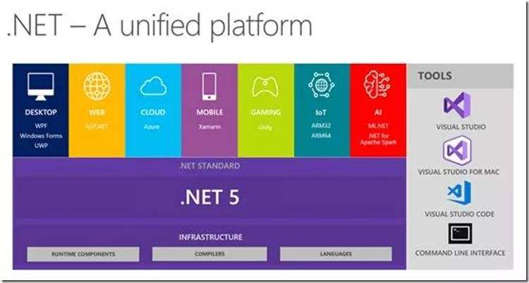

* 桌面应用
  * Windows WPF
  * Windows 窗体
  * 通用的Windows平台(UWP)
*  Web应用,Web Api和微服务
* 云中的无服务器函数,云原生应用
* 移动应用
* 游戏
* 物联网(IoT)
* 机器学习

我们可以使用类库在不同应用和应用类型中共享功能.

**跨平台**

我们现在可以为许多操作系统创建.Net应用,包括:

* Windows
* Linux
* macOS
* Android
* iOS
* tvOS
* watchOS

支持的处理器体系结构包括:

* X64
* X86
* ARM32
* ARM64

**SDK和运行时**

.Net SDK是一组用于开发和运行.Net应用程序的库和工具.

下载.NET的时候,我们可以选择SDK或者运行时,例如.Net运行时或ASP.NET Core运行时.在要准备运行.Net应用的计算机上安装运行时.在要用于开发的计算机上安装SDK.(**一般我们服务器上安装的是运行时,自己的开发电脑会安装SDK**)

> 如果自己的电脑已安装vs2019或者vs2022,则该ide工具自带安装了,不需要我们再去手动安装SDK

SDK下载地址: [https://dotnet.microsoft.com/en-us/download](https://dotnet.microsoft.com/en-us/download)

SDK下载包括以下组件:

* .Net Cli . 用于本地开发和持续集成脚本的命令行工具
* `dotnet` 驱动程序. 用于运行依赖于框架的应用的CLI命令
* Roslyn和F#编程语言编译器
* MSBuild生成引擎
* .NET运行时. 提供类型系统,程序集加载,垃圾回收器,本机互操作和其他基本服务
* 运行时库. 提供基元数据类型和基本实用程序
* ASP.NET Core运行时. 为连接Internet的应用(如Web应用,IoT应用和移动后端)提供基本服务
* 桌面运行时.为Windows桌面应用(包括Windows窗体和WPF)提供基本服务

运行时下载包括以下组件:

* (可选) 桌面或ASP.NET Core 运行时
* .Net 运行时. 提供类型系统,程序集加载,垃圾回收器,本机互操作和其他基本服务
* 运行时库. 提供基元数据类型和基本实用程序
* `dotnet` 驱动程序. 用于运行依赖于框架的应用的CLI命令

## 三. .NET CLI技术

.NET 命令行接口(CLI)工具是用于开发,生成,运行和发布.NET应用程序的跨平台工具链

> 主要针对于的是在macOS环境下或者Linux环境下做.net开发的人员,windows环境下使用的vs开发工具底层也是通过这些指令进行操作的

### 1.  CLI命令

CLI命令共包含四种命令: 基本命令,项目修改命令,高级命令,工具管理命令

#### a. 基本命令

| 命令    | 说明                                                         |
| ------- | ------------------------------------------------------------ |
| new     | 创建命令,用于创建项目                                        |
| restore | 恢复项目的依赖项和工具                                       |
| build   | 生成项目及其所有依赖项                                       |
| publish | 将应用程序及其依赖项发布到文件夹以部署到托管系统             |
| run     | 无需任何显示编译或启动命令即可运行源代码                     |
| test    | 用于执行单元测试的.NET测试驱动程序.                          |
| vstest  | 从指定的程序集运行测试                                       |
| pack    | 将代码打包到 NuGet 包                                        |
| migrate | 将预览版 2 .NET Core 项目迁移到 .NET Core SDK 样式的项目中   |
| clean   | 清除项目输出。                                               |
| sln     | 在 .NET 解决方案文件中列出或修改项目                         |
| help    | 命令打开 docs.microsoft.com 参考页，以提供指定命令的更多详细信息。 |
| store   | 将指定的程序集存储到[运行时包存储区](https://docs.microsoft.com/zh-cn/dotnet/core/deploying/runtime-store)。 |

#### b. 项目修改命令

| 命令             | 说明                        |
| ---------------- | --------------------------- |
| add package      | 向项目文件添加包引用        |
| add reference    | 添加项目到项目 (P2P) 引用。 |
| remove package   | 从项目文件删除包引用。      |
| remove reference | 删除项目到项目 (P2P) 引用。 |
| list reference   | 列出项目到项目引用          |

#### c. 高级命令

| 命令                  | 说明                                                         |
| --------------------- | ------------------------------------------------------------ |
| nuget delete          | 从服务器删除或取消列出包。                                   |
| nuget locals          | 清除或列出本地 NuGet 资源。                                  |
| nuget push            | 将包推送到服务器，并将其发布                                 |
| msbuild               | 生成项目及其所有依赖项。 注意：如果有多个解决方案或项目文件，可能需要指定一个。 |
| dotnet install script | 用于安装 .NET SDK 和共享运行时的脚本。                       |

#### d. 工具管理命令

| 命令           | 说明                                                         |
| -------------- | ------------------------------------------------------------ |
| tool install   | 在计算机上安装指定的 [.NET 工具](https://docs.microsoft.com/zh-cn/dotnet/core/tools/global-tools) |
| tool list      | 列出计算机上当前安装的所有指定类型的 [.NET 工具](https://docs.microsoft.com/zh-cn/dotnet/core/tools/global-tools) |
| tool update    | 在计算机上更新指定的 [.NET 工具](https://docs.microsoft.com/zh-cn/dotnet/core/tools/global-tools)。 |
| tool restore   | 通常将本地工具添加到存储库的根目录。 将清单文件签入到存储库后，从存储库中签出代码的开发人员会获得最新的清单文件。我们可以通过这个命令安装清单文件中列出的所有工具 |
| tool run       | 用于调试本地工具                                             |
| tool uninstall | 从计算机上卸载指定的 [.NET 工具](https://docs.microsoft.com/zh-cn/dotnet/core/tools/global-tools)。 |

**命令结构**

CLI命令结构包含驱动程序(dotnet)和命令,还可能包含命令参数和选项.在大部分CLI操作中可看到此模式,例如:创建新控制台应用并从命令行运行该应用

``` shell
dotnet new console #console是控制台的短命称
```

## 四. C# 基础语法

### 1. C#语言发展

微软公司于2002年发布的C#1.0语法，到现在已经有20年了，今年正好是.net20周年。微软公司基本每隔几年就会发布一个新的版本C#，每次发布的内容更改具体内容如下

C# 1.0 其中包含了静态类型的面向对象编程语言的所有重要特性

C# 2.0 是在2005年发布的，重点内容是使用泛型实现强数据类型，提高代码的性能，减少类型错误

C# 3.0 是在2007年发布的，重点内容是使用语言集成查询（Linq）以及匿名类型和Lambda表达式的支持，并且在这一年微软发布了一种新的开发模式 --- MVC模式

C# 4.0 是在2010年发布的，重点内容是利用F#和Python等动态语言改进互操作性，其中包括 动态类型，命名可选参数

C# 5.0 是在2012年发布的，这个也是我们学校主要学习的内容，重点知识是简化异步操作支持，从而在编写类似于同步语句的语句时自动实现复杂的状态机

C# 6.0 是在2015年发布的，并且这一年也是.net core出现的一年，这一年C#语法没有发生太大的改变，只是在原有的基础上新增了静态导入，内插字符串，表达式体成员等

C# 7.0 是在2017年发布的，重点是添加功能语言特性，如：元组和模式匹配，还对语言做了细微的改变，具体如下：

| 功能                     | 主题                       |
| ------------------------ | -------------------------- |
| 二进制字面量和数字分隔符 | 存储整数                   |
| 模式匹配                 | 利用if语句进行模式匹配     |
| out变量                  | 控制参数的传递方式         |
| 元组                     | 将多个值与元组组合在一起   |
| 局部函数                 | 定义局部函数               |
| 默认字面量表达式         | 使用默认字面量设置字段     |
| 推断元组元素的名称       | 推断元组的名称             |
| async Main               | 改进对控制台应用程序的响应 |
| 数字字面量中的前导下画线 | 存储整数                   |
| 非追踪的命名参数         | 可选参数和命名参数         |

C# 8.0 是2019年发布的，主要关注与空处理相关的语言的重大变化，主要内容如下：

| 功能           | 主题                           |
| -------------- | ------------------------------ |
| 可空引用类型   | 使引用类型可空                 |
| switch表达式   | 使用switch表达式简化switch语句 |
| 默认的接口方法 | 了解默认接口方法               |

C# 9.0 是2020年发布，关注于记录类型，模式匹配的细化以及极简代码（Minimal-Code）控制台应用程序，主要内容如下：

| 功能                   | 主题             |
| ---------------------- | ---------------- |
| 极简代码控制台应用程序 | 顶级程序         |
| 改进的模式匹配         | 与对象的模式匹配 |
| 记录                   | 操作记录         |

### 2. 使用变量

#### 2.1 命名

|  命名约定  |       示例        |                  使用场合                  |
| :--------: | :---------------: | :----------------------------------------: |
|  驼峰命名  | cost,orderDetails |             局部变量，私有字段             |
| pascal命名 | Cost,OrderDetails | 类型，非私有字段，以及其他成员（如：方法） |

#### 2.2 常用的数据类型

C#当中常用的数据类型一共有2种，分别是 值类型和引用类型，他们分别包含了多种的内容，具体如下：

| 类型名   | 包含内容                                        |
| -------- | ----------------------------------------------- |
| 值类型   | int, double,float ,demial,bool,char,enum,struct |
| 引用类型 | string, class , object , array                  |

> 面试题： 
>
> 1. double 与 decimal 的区别：
>
>    double类型并不能保证值是精确的，因为有些数字不能表示为浮点型，decimal类型是精确的，因为这种数据类型可以将数字存储为大整数并移动小数点。
>
>    除此之外我们还需要注意double数据类型的值不能使用==来进行判断相等，历史上第一次海湾战争期间，美国爱国者导弹系统在计算的时候就是使用了double值，这种不精确性导致导弹无法跟踪和拦截来袭的伊拉克飞毛腿导弹。

**微软公司强烈推荐创建变量的时候使用var弱类型进行创建**

#### 2.3 控制流程和转换类型

##### 2.3.1 运算符

首先我们现需要去了解一下运算符，之前我们学习的时候也是学习了运算符的，运算符可将简单的操作应用于操作数，他们通常会返回一个新值，作为分配给变量的操作结果。

大多数的运算符都是二元的，这意味着他们可以处理两个操作数，例如：

``` C#
var resultOfOperation = firstOperand operator secondOperand
```

> 注： operator这个是c#当中的关键字是操作符的意思

###### 2.3.1.1 一元运算符

我们日常开发当中有2个常用的一元运算符，++ 和 --,我们常用这两个运算符进行值的递增和递减，我们需要注意这两个符号操作时值的变化，这个是重点

###### 2.3.1.2 二元运算符

二元运算符其实就是我们在学校学习的这些运算符了，包括： 算数运算符，赋值运算符，逻辑运算符，关系运算符，除此之外我们还有其他运算符，例如：

nameof 与 sizeof 这两个也是我们比较常用的运算符，他们属于其他运算符。

nameof 它会以字符串格式的形式返回变量、类型或成员的短名称（没有命名空间），这在输出异常消息的时候非常有用

sizeof 它会返回简单类型的字节大小，这对于数据存储的效率很有用。

##### 2.3.2 选择语句

 选择语句当中我们比较常用的是if语句和switch语句，if语句可以适用于所有的选择情况，但是在一些常见的场景种使用switch语句会简化代码，例如：当一个变量有多个值，而每个值都需要进行不同的处理时

###### 2.3.2.1 if语句

if语句的几种模式就不介绍了，在这里我们主要还是需要讲解一下C# 7.0新增的模式匹配

在C# 7.0之后的语法当中，if语句可以将is 关键字与局部变量声明结合起来进行使用，从而使代码更加安全。例如下面的代码：

``` C#
object o = 3;
int j = 4;
if(o is int i)
{
    Console.WriteLine($"{i} x {j} = {i*j}");
}
else
{
    Console.WriteLine("o is not an int , so it cannot multiply!");
}
```

运行上面的代码，控制台会输出

3 x 4 = 12

###### 2.3.2.2 switch语句

与上面的if语句一样，在C# 7.0之后模式匹配也可以与switch语句连用。case后面的值不再必须是字面值，还可以是模式。

下面看一个使用文件夹路径与switch语句匹配的模式示例。

``` C#
using System;
using System.IO;

static void Main(string[] args)
{
	string path = @"c:\Code\Demo1";
    Console.Write("Press r for readonly or w for write");
    ConsoleKeyInfo key = Console.ReadKey();
    
    Stream s = null;
 	if(key.Key == ConsoleKey.R)
    {
        s = File.Open(
        	Path.Combine(path,"file.text"),
            FileMode.OpenOrCreate,
            FileAccess.Read);
    }
    else
    {
        s = File.Open(
        	Path.Combine(path,"file.text"),
            FileMode.OpenOrCreate,
            FileAccess.Write); 
    }
    string message = string.Empty;
    switch(s)
    {
        case FileStream writeableFile when s.canWrite:
            message = "the stream is a file that I can write to.";
            break;
        case FileStream readOnlyFile:
            message = "the stream is a read-only file.";
            break;
        case MemoryStream ms:
            message = "the stream is a memory address.";
            break;
        default:
            message = "the stream is some other type.";
            break;
        case null:
            message = "the stream is null.";
            break;
    }
    Console.Write(message);
}
```

运行控制台程序，我们会发现，名为s的变量被声明为Stream类型，因而可以是流的任何子类型，比如内存流或文件流。在上面这段代码种，流是使用File.Open方法创建的文件流。由于使用了FileMode,而文件流是可写的或只读的，因此我们会得到一条描述情况的消息，如下：

> the stream is a file that I can write to.

看了上面的代码我们发现在case语句后面是可以包含when关键字以执行更具体的模式匹配的，观察上面的代码。在第一个子句case中，只有当流是FileStream且CanWrite属性为true时，s变量才是匹配的。

在C#8.0及更高的版本中，可以使用switch表达式简化switch语句。

大多数的switch语句都非常简单，但是他们需要大量的输入。switch表达式的设计目的是简化需要输入的代码，同时仍然表达相同的意图。所有的case子句都将返回一个值以设置单个变量。switch表达式使用 => 来表示返回值。

下面我们通过这种简化写法把上面代码中的switch语句简化一下：

``` C#
message = s switch
{
    FileStream writeableFile where s.CanWrite
        => "the stream is a file that I can write to.",
    FileStream readOnlyFile
        => "the stream is a read-only file.",
    MemoryStream ms 
        => "the stream is a memory address.",
    null
        => "the stream is null.",
    _
        => "the stream is some other type."    
};
Console.Write(message);
```

区别主要是去掉了case和break关键字，下划线字符用于表示默认的返回值。

##### 2.3.3 迭代语句

C#当中的迭代语句一共有4种，分别是while，do-while,for,foreach 这些也是我们在S1,S2阶段比较常用的语法，没有什么改变还是当条件为真的时候就进入迭代，语法不在赘述。

##### 2.3.4 转换

C#当中数据类型的转换一共有2种方式，分别是隐式转换和显示转换，隐式转换只存在于低等数据类型转换高等数据类型当中，例如： int 转换为double

``` C#
int a = 10;
double b = a;
```

数据类型的显示转换有2种语法可以进行转换:

第一种：

> 数据类型.Parse(要转换的变量);

这种转换要求：要进行转换的变量必须是string类型的值

第二种：

> Convert.To数据类型(要转换的变量);

这种转换对要进行转换的值没有任何要求，可以转换为任意数据类型

注： 在C#中，所有的数据类型转换为string类型的值时候，我们只需要用这个变量名调用对应的ToString方法即可。


## 五. C# 高级语法

### 5.1 依赖注入

在维基百科当中对依赖注入是这样解释的:"依赖注入是一种软件设计模式,指一个或者多个依赖(或服务)被注入,或通过引用传递,传入一个依赖对象(或客户端)并成为客户状态的一部分.该模式通过自身的行为分离了客户依赖的创建,这允许程序设计是松耦合的,同时遵循依赖倒置和单一职责原则.与服务定位器模式直接进行对比,它允许用户了解他们用来查找依赖的机制."

由于依赖注入的概念难免有些晦涩,因此我们通过下面的这例子详细的了解一下依赖注入.

以前我们的做法是直接实例化类,代码如下.这种方式是不推荐的,因为它无法将系统解耦.

``` C#
public IActionResult Index()
{
    IStudentManager _stuMgr = new StudentManager();
    return View();
}
```

下面的是推荐的写法:

``` C#
public class HomeController : Controller
{
    private IStudentManager _stuMgr;
    public HomeController(IStudentManager stuMgr)
    {
        _stuMgr = stuMgr;
    }
    
}
```

这种是通过构造函数的方式注入IStudentManager到HomeController中,而不是HomeController对IStudentManager接口创建新的实例化. 这成为构造函数注入,因为我们使用构造函数来注入依赖项.如果我们在此时运行项目,则会收到以下错误

> InvalidOperationException:Unable to resolve service for type"xxxxx.IStudentManager" while attempting to activate "xxxx.HomeController".

这个是因为如果有人请求实现IStudentManager的对象,Asp.Net Core依赖注入容器不知道要提供哪个对象实例,原因如下:

IStudentManager可能有多个实现.在我们的项目中只有一个实现,那就是StudentManager

**使用依赖注入注册服务**

Asp.Net Core提供以下3种方法来使用依赖注入注册服务.我们使用的方法决定了注册服务的声明周期.

**(1) AddSingleton() 方法**

AddSingleton()方法创建一个Singleton服务.首次请求时会创建Singleton服务,然后所有后续请求都使用相同的实例.因此通常每个应用程序只创建一次Singleton服务,并且在整个应用程序生命周期种使用该单个实例.

**(2) AddTransient()方法**

AddTransient()方法可以称作暂时性模式,它会创建一个Transient服务.每次请求时,都会创建也给新的Transient服务实例

**(3) AddScoped()方法**

AddScoped()方法创建一个Scoped服务.在范围内的每个请求中创建一个新的Scoped服务实例.比如,在Web应用程序中,它为每个HTTP请求创建一个实例,但在同一HTTP请求的其他调用中使用相同的实例;在一个客户端请求中是相同的,而在多个客户端请求中是不同的.

我们需要在Startup类中的ConfigureServices方法中添加如下代码:

``` C#
services.AddSingleton<接口名,实现类名>();
services.AddTransient<接口名,实现类名>();
services.AddScoped<接口名,实现类名>();
```


### 5.2 异步编程

在.Net Framework 4.5的时候,微软公司把任务并行库(Task Para uel Library,TPL)添加到.Net中,,以使并行编程更加容易. C#5.0的时候添加了async和await两个关键字来简化异步编程.

使用异步编程,方法调用时在后台运行(通常在线程或任务的帮助下),并且不会阻塞调用线程.

我们想要使用异步编程需要在想要设定异步的方法上添加async修饰符,并且我们需要把返回值通过Task来进行约束

当我们的方法是没有返回值的,那么我们可以按照下面的示例进行声明

``` C#
public async Task Show(){
   
}
```

但是当我们的方法是带有返回值的时候,我们需要把返回值类型设定为Task的泛型,用于约束返回值的类型,代码如下:

``` C#
public async Task<int> Show(){
    return 0;
}
```

当我们调用异步的方法时,需要在这个方法的前面加上await关键字(**使用await关键字的时候,需要书写的这个方法必须被async关键字进行修饰**)

``` C#
public async Task Haha()
{
    await Show();
}
```


### 5.3 委托

委托是C#当中类型安全的类,它定义了返回类型和参数类型.委托类不仅包含对方法的引用,也可以包含对多个方法的引用.

当我们要把方法传送给其他方法的时候(指当作参数传送),我们据需要使用委托了.

#### 5.3.1 声明委托

在C#当中使用一个类的时候,我们首先需要去先定义这个类,告诉编译器我们的这个类当中都包含哪些内容,然后去实例化这个类,调用其中的内容.我们在使用委托的时候与上面的步骤一致,我们也需要前去声明,之后再去使用.

声明委托的语法如下:

``` C#
权限修饰符 delegate 返回值 委托名称([参数列表]);
```

例如:

``` C#
public delegate void MyDelegate(int x);
```

上面声明了一个无返回值,带有一个参数的委托.理解委托的一个要点是他们的类型安全性非常的高.在定义委托时,必须给出它所示的方法的签名和返回类型等全部细节.

#### 5.3.2 使用委托

观察下面代码我们现在需要得到一个全新的字符串内容,

``` C#
public delegate int GetAString(string a); //声明一个带有参数,带有返回值的委托

public static void Main(String[] args){
    string str = "abcd";
    GetAString gas = new GetAString(GetStringLength); //实例化上面的委托对象,并且把我们要使用的方法当作参数进行传递
    Console.WriteLine($"字符串的长度是{gas(str)}"); //这个是使用我们的委托对象,在使用时需要传递对应方法的参数值
}

public static int GetStringLength(string s) //声明一个静态的方法,得到字符串的长度
{
    return s.length;
} 
```

我们在使用委托的时候需要注意: **我们在传递方法的时候,要求这个方法必须与我们声明的委托返回值类型相同,参数列表完全相同**

#### 5.3.3 Action\<T> 和 Func\<T>

我们除了使用上面的声明委托方式进行声明以外,还可以使用.Net给我们封装好的委托类型Action和Func委托.

泛型Action\<T>委托表示引用一个void返回类型的方法,泛型T是对参数的修饰,这种委托存在不同的变体,可以传递至多16种不同的参数类型.如果我们创建一个不带有泛型的Action委托,则代表我们要调用的方法没有参数.

Func\<T>可以使用类似的方式进行使用.Func\<T> 允许我们调用带有返回值类型的方法.与Action\<T>类似,Func\<T>也定义了不同的变体,至多可以传递16个参数类型和一个返回值类型.当我们书写多个泛型的时候,最后一个泛型**一定**是对返回值类型的约束

#### 5.3.4 Lambda表达式

使用Lambda表达式的一个场合是把lambda表达式赋予委托类型:在线实现代码.只要有委托参数类型的地方,就可以使用lambda表达式.

例如:

``` C#
class Program
{
    static void Main()
    {
       		 string mid = ", middle part ,";  //声明一个string变量

            Func<string, string> func = parma =>
            {
                parma += mid;
                parma += "and this was added to the string.";
                return parma;
            }; //创建一个Func委托,要求带有一个string类型参数和string类型的返回值, 委托调用的方法是把传递进来的参数进行拼接
            //把上面的变量和里面带有的一个string与string类型的参数拼接到一起,并且返回.

            Console.WriteLine(func("Start of string"));
        
    }
    
}
```

 当我们运行上面的代码的时候得到的返回值是

``` cmd
Start of string , middle part , and this was added to the string.
```

lambda运算符"=>"的左边列出了需要的参数,而其右边定义了赋予lambda变量的方法的实现代码.


## 六. .Net MVC

### 6.1 什么是MVC

Asp.Net Core MVC是使用“模型-视图-控制器”设计模式构建的Web应用和API的丰富框架。

MVC体系结构模式将应用分成3个主要部分：模型、视图和控制器。此模式有助于实现**关注点分离**。使用此模式，用户请求被路由到控制器，后者负责使用模型来执行用户操作或检索用户查询结果。控制器选择要显示给用户的视图，并提供所需要的任何模型数据。

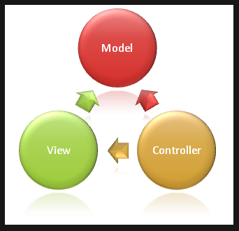

### 6.2 项目结构

我们通过Visual Studio 2022(或者Visual Studio 2019)创建 Asp.Net Core Web应用程序（模型-视图-控制器）项目这个就是我们要用的mvc项目。

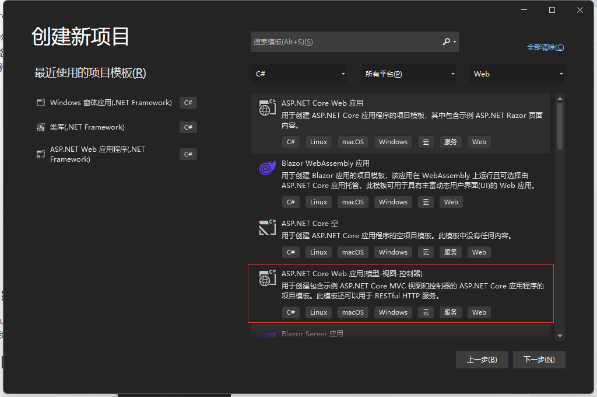

创建完成之后，项目结构如下：

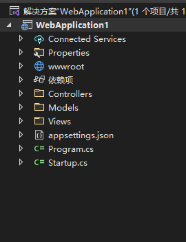

我们在这个结构中需要知道：

1. wwwroot 这个文件夹是让我们存放静态资源的，里面包含css,js,图片等等内容
2. 依赖项就是我们之前.net framework项目当中的引用
3. Controllers文件夹当中存放我们的控制器内容
4. Models文件夹当中存放的我们的模型内容
5. Views文件夹当中存放视图文件
6. appsettings.json文件用于配置项目，与原.net framework 项目当中的web.config一致
7. Program.cs文件是我们当前项目的运行主文件，里面带有主方法
8. Startup.cs 文件是我们配置中间件的文件


我们通过查看各个文件知道了appsetting.json文件当中的所有配置内容都是json格式的内容，我们以后要对当前项目进行配置例如：创建一个与数据库连接的语句等等这些操作时，需要书写一个类似的json字符串

我们现在需要把重点放到Startup类当中，具体代码如下：

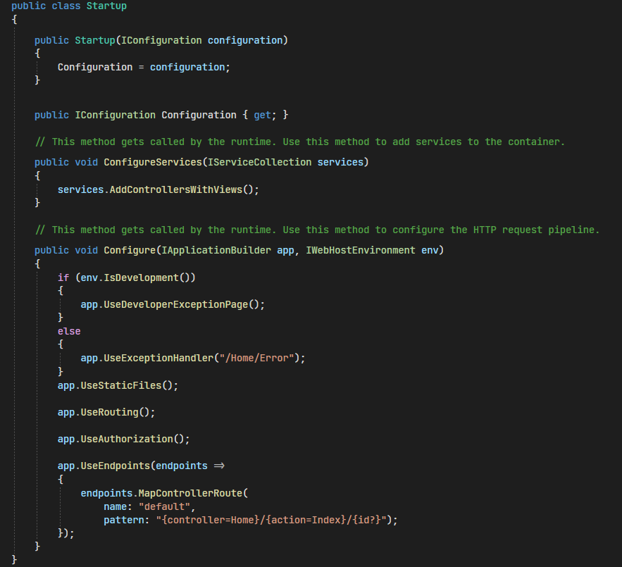

Startup类用于配置服务和应用的请求管道。

服务是应用使用的组件。例如：日志记录组件就是一项服务。配置（或注册）服务的代码应添加到Startup.ConfigureServices方法中。

请求管道由一系列中间件组件组成。例如：中间件可能处理对静态文件的请求或将HTTP请求重定向到HTTPS。每个中间件在HttpContext上执行异步操作，然后调用管道中的下一个中间件或者终止请求，配置请求处理管道的代码应添加到Startuo.Configure方法当中。

### 6.3中间件

通常我们通过在Startup.Configure方法中调用其Use...扩展方法，向管道添加中间件组件。例如：我们想要启用静态文件，我们就需要添加调用UseStaticFiles方法。

我们常见的中间件有：

| 中间件方法       | 说明                                                         |
| ---------------- | ------------------------------------------------------------ |
| UseStaticFiles   | 启用静态文件的中间件                                         |
| UseRouting       | 启用路由的中间件                                             |
| app.UseEndpoints | 启用终点的中间件，这个中间件主要的作用就是给路由进行配置规则 |


### 6.4创建控制器

我们在Controllers文件夹上鼠标右键选择添加控制器，在添加控制器的时候我们一定要注意：

1. 所有的控制器命名时必须时以Controller为结尾
2. 必须创建在Controllers文件夹当中
3. 控制器的真正的名字是Controller前面的内容。例如：我们创建一个关于我们的控制器，则起名应该是AboutController，其中About是名字，Controller是必带的后缀

创建完成之后我们在创建的控制器内可以看到一个默认带有的Index方法,代码如下：

``` C#
public IActionResult Index()
{
    return View();
}
```

我们需要知道的是这个方法就是让我们创建视图的方法，其中IActionResult这个就是我们返回视图界面时的返回值类型，这个类型当中包含了视图内容与Json结果。 return 后面的View()方法则代表了我们返回的视图方法。

### 6.5 创建视图

创建视图我们一共有2种方法：

第一种是我们在要创建视图的方法名上鼠标右键，就会看到添加视图，点击添加视图即可去创建该方法对应的视图内容。

第二种创建方式是我们完全去手动创建。

假如我们有如下的控制器代码：

``` C#
public class AboutController : Controller
{
    public IActionResult Index()
	{
    	return View();
	}
    
}
```

我们只需要去项目当中的Views文件夹下，创建一个与控制器同名的文件夹，这个里面就是About文件夹，之后在这个文件夹下创建一个名字为Index的Razor视图即可，这个视图文件就是我们About控制器下Index方法对应的视图文件。

### 6.6 控制器给视图传值

控制器给视图传值一共有4种方式：

（1） ViewData方式

这种方式是以类似于Session对象的方式进行传递值，语法如下：

``` C#
ViewData["key"] = value;
```

这种传递方式会进行装箱和拆箱操作，所以安全性较高，但是每次使用时都需要进行强制转换，所以效率较低。

(2)  ViewBag方式

这种方式是让我们设定一个ViewBag的属性，然后通过这个属性进行传递至，语法如下：

``` C#
ViewBag.Key = value;
```

这种传递方式不需要进行装箱和拆箱操作，所有安全性较低，但是效率比ViewData高

(3) TempData方式

这种方式使用时的语法与ViewData相同,但是这种方式在使用的时候只能用一次,用过一次之后就会消失

``` C#
TempData["key"] = value;
```

这种方式我们一般用于存储验证码等等只能使用一次的技术

(4) 强类型视图传值

这种方式是我们最常见的一种,也是MVC当中比较主要的一种.

在我们控制器返回视图的同时把值传递到视图当中

控制器的语法如下:

``` C#
public IActionResult Index()
{
    return View(值);
}
```

在视图当中,我们需要在首行进行设定强类型视图的值和类型

视图当中语法如下

``` C#
@model 传过来值的类型
@{
    Layout = null;
}    
<!doctype html>
<html>
    <head></head>
    <body></body>
</html>    
```

在接收值之后我们需要在页面使用时,可以通过@Model来进行使用,这个Model就是我们传递过来的值在页面里面存储到的变量,通过这个变量我们就能够使用传递过来的值了,需要注意的是传递过来的值是什么类型的这个Model就是什么类型

### 6.7 Razor视图语法

#### 6.7.1 Razor基本语法

我们Razor试图语法，暂时只需要记住两种，

第一种是@{  } 这个花括号当中需要存放C#的带有变量赋值的语法

第二种是@后面直接加上C#基本语法例如：if,while,for等等基础语法

#### 6.7.2 Html Helper标签

Html Helper是为了方便View开发而产生的。

在MVC中，普通首页超级链接为\<a href="/home/index">首页\</a>,当路由改变时可能需要修改为\<a href="/home_bdqn/index">首页\</a>，如果项目里面有很多超链接就需要改动很多地方。

我们需要的时路由改变也不受影响：\<a href="<%=Url.Action("Index","Home")%>">首页\</a>。因为没有智能感知，调试不方便，所以应运而生了Html.Action("Home","Index").

##### HtmlHelper的Action、表单标签

###### (1) ActionLink( )

 ``` C#
 @Html.ActionLink("超链接文本信息","方法名"[,"控制器名",路由值,html属性])
 ```

动态生成超链接，根据路由规则，生成对应的HTML代码,语法当中中括号当中的内容是可省略的.

案例:

``` C#
@Html.ActionLink("关于我们","Info","About",new{ id = 1},new{ @class="txt"})
```

需要注意的是因为class是C#当中的关键字,所以我们在html属性当中要书写class属性的时候需要在前面加上一个@符

###### (2) Form

``` C#
@using(Html.BeginForm("方法名","控制器名"[,FormMethod提交方式,路由值)){}
```

我们强烈推荐上面的这种写法通过C#代码当中using语句自动实现结束的form标签,只要出了后面的花括号,就代表结束了form标签

案例:

``` C#
@using(Html.BeginForm("Add","Grades",FormMethod.Post,new{ enctype="multipart/form-data"})){ }
```

###### (3) 文本框

``` C#
@Html.TextBox("name属性值")
```

上面的写法是文本框的弱类型写法,只会生产一个input标签,并不会带有对应的值

案例:

``` C#
@Html.TextBox("Title")
```

当我们页面上存在这强类型视图传值的时候,并且需要把这个值在文本框当中显示时,我们需要用到下面的强类型视图的写法 

``` C#
@Html.TextBoxFor(自己起一个名字 => 用自己的名字.你要放入到这个地方的属性名)
```

我们在小括号当中自己的名字是创建一个用于接收强类型视图传值的对象名,通过这对象名来进行调用

案例:

``` C#
@Html.TextBoxFor(m => m.Id)
```

###### (4) 密码框

弱类型

``` C#
@Html.Password("name属性值")
```

强类型

``` C#
@Html.PasswordFor(自己起一个名字 => 用自己的名字.你要放入到这个地方的属性名)
```

使用方式与文本框相同

###### (5) 隐藏域

弱类型

``` C#
@Html.Hidden("name属性值")
```

强类型

``` C#
@Html.HiddenFor(自己起一个名字 => 用自己的名字.你要放入到这个地方的属性名)
```

使用方式与文本框相同

###### (6) 单选按钮

``` C#
@Html.RadioButton("name属性名","返回的值",是否选中)
```

是否选中的位置上只能输入true或者false

案例:

``` C#
@Html.RadioButton("Gender","男",true)男</br>
@Html.RadioButton("Gender","女",false)女
```

当name属性值相同时,代表这几个标签为同一组的标签

###### (7) 复选框按钮

``` C#
@Html.CheckBox("name属性名","返回的值",是否选中)
```

使用方式与单选按钮相同

###### (8) 下拉列表

``` C#
@Html.DropDownList("name属性值",集合值[,html属性])
```

需要注意的时集合值的泛型必须是SelectListItem类型的集合,或者数组


#### 6.7.3 TagHelper

#### 6.7.4 Model模型验证

这个是微软公司提供的通过在封装的时候给属性添加特性进行验证的一种方式,里面的内容能够让我们更加直观的看到每个属性都带有那些数据验证.这种验证方式属于服务器验证.

我们在使用这种验证的时候,需要根据所使用的验证内容不同添加下面的2个引用,他们分为是

``` C#
using System.ComponentModel.DataAnnotations;
using System.ComponentModel.DataAnnotations.Schema;
```

##### (1) Required

``` C#
[Required(ErrorMessage="")]
public string Name{get;set;}
```

上面属性上的内容就是非空验证的写法,其中Required代表非空,小括号当中代表对这个验证属性的设定,ErrorMessage是让我们设定错误信息,只要触发了这个异常就会提示的信息.

##### (2) StringLength

``` C#
[StringLength(""[,ErrorMessage="",MinimumLength=""])]
public string Name{get;set;}
```

这个是让我们设定字符串的长度的,如果我们只写一个参数则代表这个字符串最大的长度值是这个值,后面中括号里面的内容是可选的,如果我们要进行设定则如下:

``` C#
[StringLength("50",MinimumLength="10")]
public string Name{get;set;}
```

这个代表最小长度为10,最大的长度为50.其中最小长度需要我们指明进行设定

##### (3) Column

``` C#
[Column(TypeName = "")]
public string Name{get;set;}
```

这个是让我们设定当前属性在数据库当中具体是哪个类型的,例如:string在数据库当中对应的是varchar或者nvarchar,具体使用的是哪个需要我们通过这个来进行指明.,字符串在指明用哪个的时候还需要写清长度的值

``` C#
[Column(TypeName = "varchar(50)")]
public string Name{get;set;}
[Column(TypeName = "date")]
public DateTime Birthday{get;set;}
```

##### (4) Display

这个是让我们设定当前属性的含义的,我们通过这个可以给错误信息传递当前属性的含义,不需要每个报错信息都写上含义了.

``` C#
[Required(ErrorMessage="{0}不能为空")]
[StringLength("50",MinimumLength="10",ErrorMessage="字符串{0}的长度必须在10~50之间")]
[Display(Name = "姓名")]
public string Name{get;set;}
```

##### (5) Key

这个是让我们把当前修饰的属性在数据库当中对应的列设定为主键的,如果这个属性是int类型,则这个主键会自动增长.

``` C#
[Key]
public int Id{get;set;}
```


#### 6.7.5 EF Core

EF Core(全称EntityFramework Core) 这个是微软公司开发的一个轻量级ORM(Object Relational Mapper)框架,主要是针对我们现在写的项目中与数据库映射和数据库操作的.

我们如果在现在的项目当中想要使用这个框架,首先我们需要对这个框架进行安装.

##### 1. 框架安装

这个框架安装方式我们共有2种,分别是通过Nuget包管理器安装和Nuget包管理器控制台进行安装.

###### a. Nuget包管理器

我们只要选中项目,鼠标右键之后点击管理Nuget程序包就可以进入Nuget包管理界面

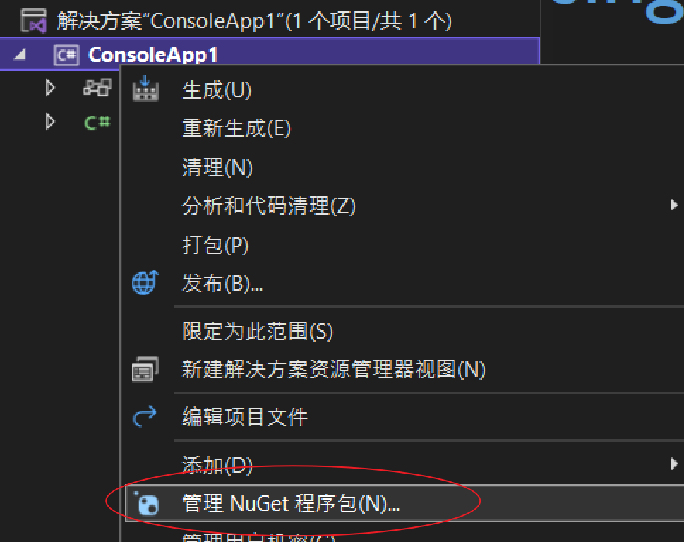

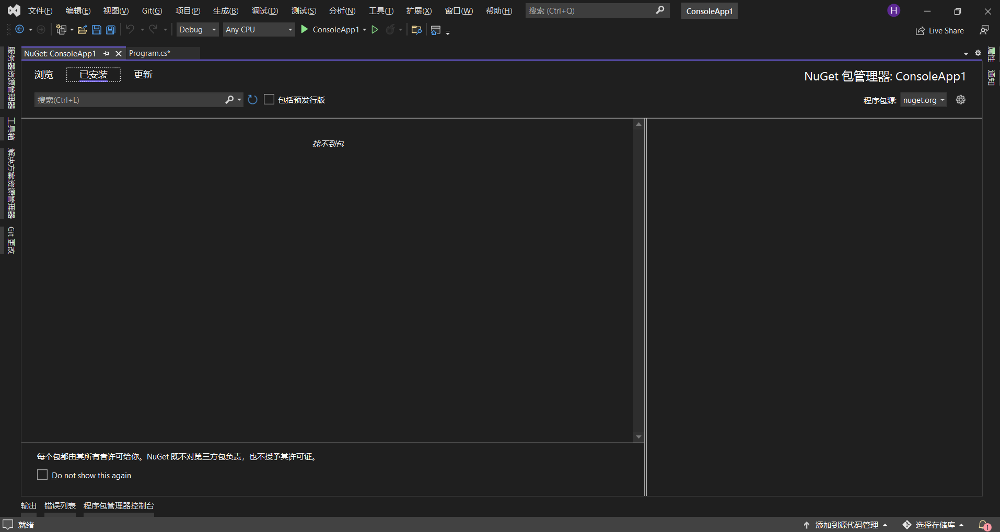

之后我们只要点击浏览的选项卡,进行搜索下面三个包进行添加即可.

Microsoft.EntityFrameworkCore

Microsoft.EntityFrameworkCore.SqlServer

Microsoft.EntityFrameworkCore.Tools

**安装时需要注意要与自己当前创建的.net core版本兼容**

###### b. Nuget包管理器控制台

我们在vs上找到并点击工具,之后鼠标停在Nuget包管理器上,又会弹出一个新的界面,在这个新的界面里选择程序包管理器控制台即可打开Nuget包管理器的控制台界面

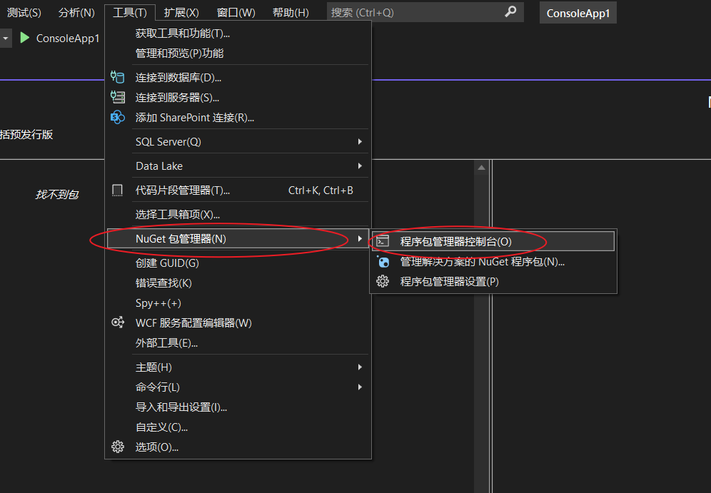

我们只需要在控制台当中输入如下代码即可安装内容

``` shell
install-package 包名 -v 版本号
```

##### 2. 项目配置

###### 2.1 配置连接语句

我们打开项目里面的appsettings.json文件,在原有的代码上进行添加连接语句的代码,效果如下:

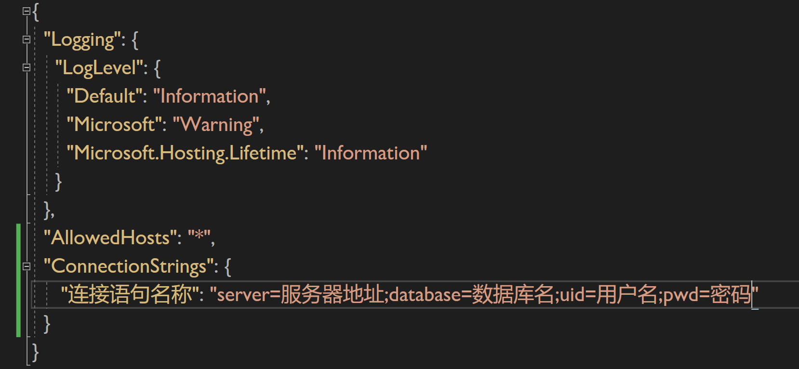 

###### 2.2 创建项目基础配置

我们只需要安装原有的方式在startup文件当中配置mvc所需的基础配置,并且创建对应的文件夹即可.

###### 2.3 封装

我们在Models文件夹当中对对应的类进行封装,在封装时需要对各个属性添加特性进行约束

###### 2.4 添加数据库上下文

我们需要在Models文件夹当中创建一个类,类名要求以数据库名为开头后面加上Context后缀,这个类就是我们的数据库上下文配置文件.

例如: StudentDbContext

创建好这个类之后我们需要继承DbContext这个父类,并且在这个类当中创建一个带参的构造函数,这个参数需要传递到父类当中,让其实现与数据库的连接操作.这个参数的类型为DbContextOptions.这个参数还需要我们传递一个泛型,这个泛型就是当前的这个数据库上下文的名字,这个类的具体效果如下:

``` C#
public class StudentDbContext : DbContext
{
    public StudentDbContext(DbContextOptions<StudentDbContext> options)
        :base(options)
    {
        
    }
    
    //下面开始设定我们数据库当中的表
    public DbSet<封装类的名字> 封装类的名字{get;set;}
    //我们以后有几个表就需要按照上面的方式封装几个
}
```

###### 2.5 配置数据库连接服务

我们需要回到startup文件,在ConfigureServices这个方法内,我们需要配置数据库上下文的服务.具体代码如下

``` C#
services.AddDbContext<我们自己创建的数据库上下文名字>(自己起一个名字 => 自己起的名字.UseSqlServer(我们导入json文件的连接语句));
```

我们导入json文件的连接语句方式为:

a. 在startup类当中封装一个 IConfiguration类型的字段,之后通过依赖注入进行存值.

``` C#
public class Startup
{
    private IConfiguration _config;
    public Startup(IConfiguration config)
    {
        _config = config;
    }
}
```

b. 之后在UseSqlServer小括号当中填入下面的代码

``` C#
_config.GetConnectionString("连接语句的名字")
```

###### 2.6 数据迁移

当我们完成了上面的步骤之后,只需要在下面的程序包管理器控制台当中输入下面的两个代码指令即可

a. add-migration 这次迁移的简单描述

例如:

``` shell
add-migration initial
```

b. update-database 更新数据库


## 七. WebApi


# 2. Web前端框架

## 一. 弹性布局


## 二. Bootstrap

### 1. 简介

Bootstrap是全球最受欢迎的前端框架之一,它用于构建响应式,移动设备有限的网站.从出现到现在已经发展到第5个版本了

### 2. 添加Bootstrap

在我们创建的web项目当中添加Bootstrap一共分为3种方式

(1) 我们可以直接在想要引入Bootstrap的页面上通过link标签进行添加,具体代码如下:

``` html
<link href="https://cdn.jsdelivr.net/npm/bootstrap@5.1.3/dist/css/bootstrap.min.css" rel="stylesheet" />
```

这种方式的好处是我们不需要下载任何文件就可以使用bootstrap的内容,但是缺点是我们的这个网页在浏览的时候电脑必须联网,能引入cdn网站上的bootstrap内容,我们自己开发的网站尽量少用这种方式因为当远程内容发生改变的时候,我们自己的网站上的bootstrap就不可用了

(2) 我们可以直接去官网进行下载,官网网址为:[https://v5.bootcss.com/](https://v5.bootcss.com/)

这种方式是比较常用的,我们直接去官网下载之后,把下载的文件解压,并且存放到我们的项目当中,我可以直接通过相对路径进行调用

(3) 我们也可以在自己创建的Web项目当中通过添加客户端库的方式进行添加,

​    a. 我们选中项目文件,鼠标右键

​    b. 鼠标听到添加上,在弹出的新的界面上就可以看到客户端库

​    c. 在弹出的新的界面当中输入bootstrap之后就会有提示内容,选择提示内容之后点击确定就能够

把Bootstrap引入到项目当中

### 3. 引入模板

当我们项目当中包含Bootstrap内容时,在对应的页面当中按照下面的内容进行配置就可以在这个页面内使用Bootstrap了

``` html
<!doctype html>
<html lang="zh-cn">
    <head>
        <meta charset="utf-8" />
        <meta name="viewport" content="width=device-width, initial-scale=1">
        <link href="~/lib/bootstrap/css/bootstrap.css" rel="stylesheet" />
        <title>引入Bootstrap</title>
    </head>
    <body>
        
        
        <script src="~/lib/jquery/jquery.js"></script>
        <script src="~/lib/bootstrap/js/jquery.js"></script>
    </body>
</html>
```

我们在下面引入js脚本的时候,我们首先必须先去引入jquery,因为bootstrap有的一些功能是通过jquery实现的,如果我们不引入jquery,再打开当前网页的时候会在浏览器当中提示错误.

上面的模板当中

``` html
<meta name="viewport" content="width=device-width, initial-scale=1">
```

这个标签是让我们所写的网页更好的支持响应式布局的标签,每次书写的时候,必须带上.

### 4. 布局

Bootstrap框架是一个自适应框架,采用的是弹性布局.里面是通过栅格系统来实现的这些内容.

Bootstrap把网页宽度,从左到右细分为12格,通过我们引入样式的大小来确定每个格所占的大小.

首先我们来了解一下样式当中如何确定显示屏幕大小的.

| 屏幕大小                  | 样式名称 | 尺寸      |
| ------------------------- | -------- | --------- |
| 超小屏(X-Small)           | 没有     | < 576px   |
| 小屏(Small)               | sm       | >= 576px  |
| 中屏(Medium)              | md       | >= 768px  |
| 大屏(Large)               | lg       | >= 992px  |
| 超大屏(Extra Large)       | xl       | >= 1200px |
| 特大屏(Extra extra large) | xxl      | >= 1400px |

其中的样式名我们会在其他的布局标签当中进行插入, 代表当我们屏幕满足这个尺寸的时候,要展示的效果.

#### 4.1 容器

我们在实现布局的时候通过会先去写一个div并且让这个div充当容器,在这个标签内部去写其他的内容.我们在使用bootstrap的时候也是,并且我们还需给这个标签添加一个容器的样式,样式与在各种屏幕大小时占有的宽度内容如下表

| 样式名           | 超小屏 | 小屏  | 中屏  | 大屏  | 超大屏 | 特大屏 |
| ---------------- | ------ | ----- | ----- | ----- | ------ | ------ |
| .container       | 100%   | 540px | 720px | 960px | 1140px | 1320px |
| .container-sm    | 100%   | 540px | 720px | 960px | 1140px | 1320px |
| .container-md    | 100%   | 100%  | 720px | 960px | 1140px | 1320px |
| .container-lg    | 100%   | 100%  | 100%  | 960px | 1140px | 1320px |
| .container-xl    | 100%   | 100%  | 100%  | 100%  | 1140px | 1320px |
| .container-xxl   | 100%   | 100%  | 100%  | 100%  | 100%   | 1320px |
| .container-fluid | 100%   | 100%  | 100%  | 100%  | 100%   | 100%   |

看完这个表之后我们知道.container样式写完之后,这个元素与页面实际宽度对比的时候会小一些.所以这个元素内容在两边会带有留白.而.container-fluid因为这个样式我们不管是多大的屏幕,引用宽度的时候都是以100%的形式存在的所以会沾满全屏.

``` html
<div class="container">
     正常的容器
</div>

<div class="container-sm">
     小屏的容器
</div>
<div class="container-fluid">
    占满全屏的容器
</div>
```

> 注意: 我们以后在一个栅格内部当中如果还想要使用栅格来进行布局,我们还需要在栅格内容引入一个容器,之后在这个容器的内容再去用栅格来进行拆分

#### 4.2 栅格系统

Bootstrap的网格系统使用一系列容器,行和列来布局和对齐内容.它是用flexbox构建的,并且是完全响应的.

``` html
<div class="container">
    <div class="row">
        <div class="col">
            Column
        </div>
        <div class="col">
            Column
        </div>
        <div class="col">
            Column
        </div>
    </div>
</div>
```

我们在容器当中,通常会一行一行的进行布局,通过row样式来进行布局这一行.

其中col样式这代表栅格,上面案例当中col会根据我们存在个数来进行自动填充这一行内容.

除了上面的用法,我们还可以在col样式的后面来进行指定是什么样的屏幕和占有几个栅格.例如:

``` html
<div class="col-sm-3">
    
</div>
```

这个代表我们在小屏幕的设备上占有3个栅格

> 如果我们想要设定的是超小屏幕我们只需要写"col-数量"即可

### 5. 页面内容

Bootstrap还提供了让我们作为页面基础的文本元素,例如:标题,文字大小等.

#### 5.1 标题

我们可以使用html当中的所有标题

``` html
<h1>
    h1. Bootstrap heading
</h1>
```

我们还可以使用.h1 ~ .h6的类选择器来进行设置

> 如果我们想要匹配标题的字体样式但又不能使用关联的HTML元素时,我们就采用这种方式.

``` html
<span class="h1">h1. Bootstrap heading</span>
```

**自定义标题**

``` html
<h3>
    Fancy display heading
    <samll class="text-muted">With faded secondary</samll>
</h3>
```

效果如下:

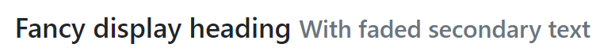

**显示标题**

当我们想要更加突出标题时,我们可以使用显示标题.,我们可以通过display-数字来进行设定. 如:

``` html
<h1 class="display-1">
    显示标题1
</h1>
```

#### 5.2 图片

我们可以通过boostrap提供的.img-fluid的样式让图片标签支持响应时布局.它的原理是将max-width:100%;和height : auto;赋予图片,以便让该图片标签随着父元素的宽度变化一起缩放. 

``` html

```

**图片的缩略图**

我们可以使用.img-thumbnail 使图片的外观具有1像素宽度的圆形边框.

``` html

```

效果为:

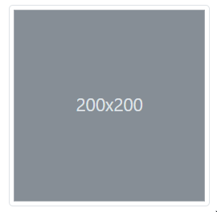


## 三. Vue


# 3. 数据库

## 一. Sql Server


## 二. MySql


## 三. PostgreSQL


## 四. Redis


## 五. MongoDb


